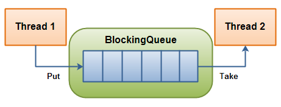
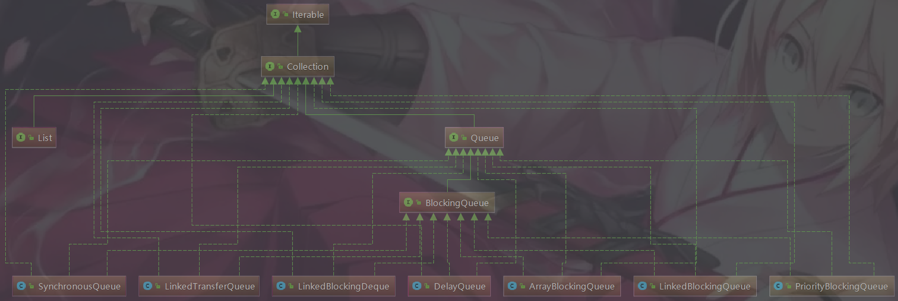

## 1.阻塞队列
### [1].当阻塞队列是空时，从队列中获取元素的操作将会被阻塞，直到其他线程往里面插入新的元素
### [2].当阻塞队列是满时，往队列里添加元素的操作将会被阻塞，直到其他线程从队列里移除一个或多个或者完全清空再继续添加

## 2.好处
### [1].在多线程领域：所谓阻塞，在某些情况下会挂起线程（即阻塞），一旦条件满足，被挂起的线程又会自动被唤醒
### [2].使用BlockingQueue的好处
    我们不在需要关心什么时候需要阻塞线程，什么时候需要唤醒线程，因为这一切BlockingQueue都处理好了，在concurrent包发布前，在多线程环境下，程序员需要手动控制这些细节，还有兼顾安全和效率
## 3.架构体系

### [1].ArrayBlockingQueue ：一个由数组结构组成的有界阻塞队列。
### [2].LinkedBlockingQueue ：一个由链表结构组成的有界（但大小默认值为Integer.MAX_VALUE）阻塞队列。
### [3].PriorityBlockingQueue ：一个支持优先级排序的无界阻塞队列。
### [4].DelayQueue：一个使用优先级队列实现的无界阻塞队列。
### [5].SynchronousQueue：一个不存储元素的阻塞队列，必须由两个线程分别调用，不然一方一直阻塞。
### [6].LinkedTransferQueue：一个由链表结构组成的无界阻塞队列。
### [7].LinkedBlockingDeque：一个由链表结构组成的双向阻塞队列
## 4.常用方法
| 方法\处理方式 | 抛出异常 | 返回特殊值 | 一直阻塞 | 超时退出 |
| ----- | ----- | ----- | ----- | ----- |
| 插入方法 | add(e) | offer(e) | put(e) | offer(e,time,unit) |
| 移除方法 | remove() | poll() | take() | poll(time,unit)|
| 检查方法 | element() | peek() | 不可用 | 不可用 |
### [1].抛出异常：
#### ①.是指当阻塞队列满时候，再往队列里插入元素，会抛出IllegalStateException(“Queue full”)异常。
#### ②.当队列为空时，从队列里获取元素时会抛出NoSuchElementException异常 。
[抛出异常示例](./code/ThrowExceptionBlockingQueueMethod.java)
### [2].返回特殊值：
#### ①.插入方法会返回是否成功，成功则返回true。
#### ②.移除方法，则是从队列里拿出一个元素，如果没有则返回null
[返回特殊值示例](./code/ReturnSpecialValueBlockingQueueMethod.java)
### [3].一直阻塞：
#### ①.当阻塞队列满时，如果生产者线程往队列里put元素，队列会一直阻塞生产者线程，直到拿到数据，或者响应中断退出。
#### ②.当队列空时，消费者线程试图从队列里take元素，队列也会阻塞消费者线程，直到队列可用。
### [4].超时退出：
#### ①.当阻塞队列满时，队列会阻塞生产者线程一段时间，
#### ②.如果超过一定的时间，生产者线程就会退出。
[超时退出示例](./code/TimeBlockingQueue.java)
## 5.SynchronousQueue
### [1].SynchronousQueue不存放元素，与其他BlockingQueue不同，SynchronousQueue容量为0。每一个put操作必须要等待一个take操作，否则不能继续添加元素，且会一直阻塞，反之亦然。而且不能调父类的add方法Queue full
### [2].代码示例
[单元素队列示例](./code/SynchronousQueueTest.java)
## 6.生产消费者的几种实现方式
### [3].使用阻塞队列模拟面包店
[使用阻塞队列模拟面包店示例](./code/ProducerConsumerBlockingQueueVersion.java)