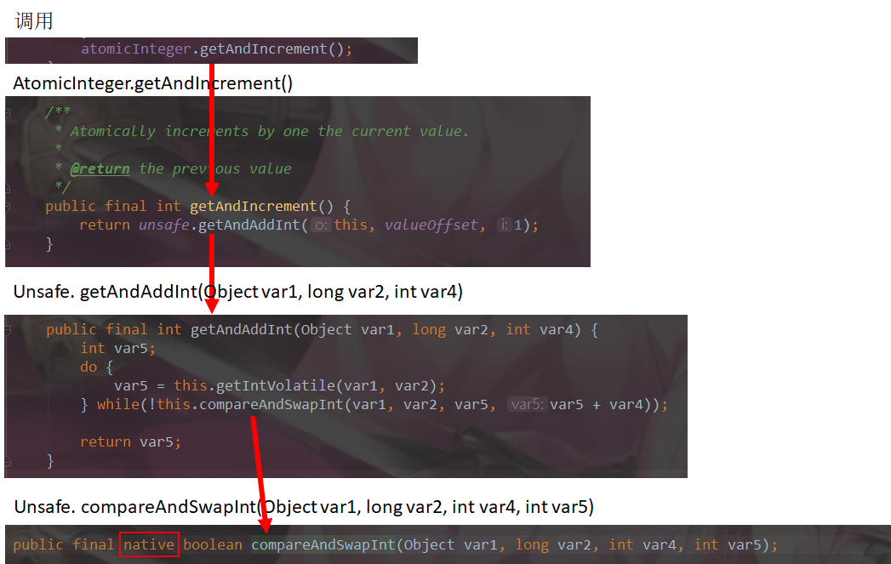

## 1.CAS是什么
### [1].在AtomicInteger中的compareAndSet方法是这么定义的，即CAS就是Compare-And-Swap（比较并交换）的缩写，另外CAS还有Central Authentication Service（统一认证服务/单点登录）等众多的含义，这里讨论的只是Compare-And-Swap这种含义
```java
/**
* Atomically sets the value to the given updated value
* if the current value {@code ==} the expected value.
*
* @param expect the expected value
* @param update the new value
* @return {@code true} if successful. False return indicates that
* the actual value was not equal to the expected value.
*/
public final boolean compareAndSet(int expect, int update) {
    return unsafe.compareAndSwapInt(this, valueOffset, expect, update);
}
```
### [2].CAS是乐观锁的一种实现
### [3].是一条CPU的原子指令，其作用是让CPU先进行比较两个值是否相等，然后原子地更新某个位置的值，其实现方式是基于硬件平台的汇编指令,CAS并发原语体现在JAVA语言中就是sun.misc.Unsafe类中的各个方法。调用UnSafe类中的CAS方法，JVM会帮我们实现出CAS汇编指令。这是一种完全依赖于硬件的功能，他通过实现了原子操作。再次强调，由于CAS是一种系统原语，原语属于操作系统用语范畴，<span style="color:red"> 是由若干条指令组成的，用于完成某个功能的一个过程并且原语的执行必须是连续的，在执行过程中不允许被终端，也就是说CAS是一条CPU的原子指令，不会造成所谓的数据不一致 </span>
## 2.CAS底层原理
### [1].源码
#### ①.AtomicInteger.getAndIncrement()方法
```java
/**
* Atomically increments by one the current value.
*
* @return the previous value
*/
public final int getAndIncrement() {
    return unsafe.getAndAddInt(this, valueOffset, 1);
}
```
#### ②.unsafe和valueOffset的定义
```java
public class AtomicInteger extends Number implements java.io.Serializable {
    private static final long serialVersionUID = 6214790243416807050L;

    // setup to use Unsafe.compareAndSwapInt for updates
    private static final Unsafe unsafe = Unsafe.getUnsafe();
    private static final long valueOffset;

    static {
        try {
            valueOffset = unsafe.objectFieldOffset
                (AtomicInteger.class.getDeclaredField("value"));
        } catch (Exception ex) { throw new Error(ex); }
    }

    private volatile int value;
```
### [3].分析
#### ①.Unsafe，是CAS的核心类，由于Java方法无法直接访问底层系统，需要通过本地（native）方法来访问，Unsafe相当于一个后门，基于该类可以直接操作特定内存的数据，其方法可以像C的指针一样操作内存，<span style="color:red">所有的方法都是native修饰的</span>，也就是直接调用操作系统资源执行。unsafe是Unsafe类的一个实例， Unsafe的具体路径为rt.jar/sun/misc/Unsafe.class
#### ②.变量valueOffset，表示该变量值在内存中的偏移地址，因为Unsafe就是根据内存偏移地址获取数据的。
#### ③.变量value用volatile修饰，保证了多线程之间的内存可见性。
### [4].调用原理

### [5].Unsafe类中的compareAndSwapInt，是一个本地方法，该方法的实现位于unsafe.cpp中，红色部分((Atomic::cmpxchg(x, addr, e)) == e;)即保证其原子性
UNSAFE_ENTRY(jboolean, Unsafe_CompareAndSwapInt(JNIEnv *env, jobject unsafe, jobject obj, jlong offset, jint e, jint x))<br/>
  UnsafeWrapper("Unsafe_CompareAndSwapInt");<br/>
  oop p = JNIHandles::resolve(obj);<br/>
  jint* addr = (jint *) index_oop_from_field_offset_long(p, offset);<br/>
  return (jint)<span style="color:red"> (Atomic::cmpxchg(x, addr, e)) == e;</span><br/>
UNSAFE_END

##### 说明：先想办法拿到变量value在内存中的地址。通过Atomic::cmpxchg实现比较替换，其中参数x是即将更新的值，参数e是原内存的值。

### [6].Atomic::cmpxchg方法

#### ①.如果是Linux的x86，的实现如下：

```c++
inline jint Atomic::cmpxchg (jint exchange_value, volatile jint* dest, jint compare_value) {
  int mp = os::is_MP();
  __asm__ volatile (LOCK_IF_MP(%4) "cmpxchgl %1,(%3)"
                    : "=a" (exchange_value)
                    : "r" (exchange_value), "a" (compare_value), "r" (dest), "r" (mp)
                    : "cc", "memory");
  return exchange_value;
}
```

    \__asm__表示汇编的开始
    volatile表示禁止编译器优化
    LOCK_IF_MP是个内联函数

#### ②.Window的x86实现如下：

```c++
inline jint Atomic::cmpxchg (jint exchange_value, volatile jint* dest, jint compare_value) {
    int mp = os::isMP(); //判断是否是多处理器
    _asm {
        mov edx, dest
        mov ecx, exchange_value
        mov eax, compare_value
        LOCK_IF_MP(mp)
        cmpxchg dword ptr [edx], ecx
    }
}


// Adding a lock prefix to an instruction on MP machine// VC++ doesn't like the lock prefix to be on a single line// so we can't insert a label after the lock prefix.// By emitting a lock prefix, we can define a label after it.#define LOCK_IF_MP(mp) __asm cmp mp, 0  \
                       __asm je L0      \
                       __asm _emit 0xF0 \
                       __asm L0:
```
    LOCK_IF_MP根据当前系统是否为多核处理器决定是否为cmpxchg指令添加lock前缀。
    如果是多处理器，为cmpxchg指令添加lock前缀。
    反之，就省略lock前缀。（单处理器会不需要lock前缀提供的内存屏障效果）
    intel手册对lock前缀的说明如下：
    确保后续指令执行的原子性。
    在Pentium及之前的处理器中，带有lock前缀的指令在执行期间会锁住总线，使得其它处理器暂时无法通过总线访问内存，很显然，这个开销很大。在新的处理器中，Intel使用缓存锁定来保证指令执行的原子性，缓存锁定将大大降低lock前缀指令的执行开销。
    禁止该指令与前面和后面的读写指令重排序。
    把写缓冲区的所有数据刷新到内存中。
<span style="color:red">个人觉得能理解到Unsafe类（第[4]点）已经够面试了</span>
## 3.CAS缺点
### [1].循环时间长，开销大
```java
    public final int getAndAddInt(Object var1, long var2, int var4) {
        int var5;
        do {
            var5 = this.getIntVolatile(var1, var2);
        } while(!this.compareAndSwapInt(var1, var2, var5, var5 + var4));

        return var5;
    }
```
    如果长时间不成功，可能会给CPU带来巨大的开销
### [2].只能保证<span style="color:red">一个</span>共享 变量的原子操作
    当多个共享变量操作时，循环CAS就无法保证操作的原子性，这时只能加锁
### [3].ABA问题
#### [ABA问题代码](./code/ABATest.java)
CAS算法实现的一个重要前提需要取出内存中某时刻的数据并在当下时刻比较替换，那么在这个时间差内会导致数据的变化
如果变量V初次读取的时候是A，并且在准备赋值的时候检查到它仍然是A，那能说明它的值没有被其他线程修改过了吗？<span style="color:red">如果在这段期间曾经被改成B，然后又改回A，那CAS理论就会误认为它从来没有被修改过</span>。针对这种情况，java并发包中提供了一个带有标记的原子引用类[AtomicStampedReference](#atomicStampedReference)，它可以通过控制变量值的版本来保证CAS的正确性。
## 4.原子引用
### [1].AtomicReference
#### ①.说明：即为原子类的包装类型
```java
public class AtomicReference<V> implements java.io.Serializable {
```
#### ②.实例
[AtomicReference示例代码](./code/AtomicReferenceTest.java)
### [2].<span style="color:red" id="atomicStampedReference">用带标记的原子引用AtomicStampedReference解决ABA问题</span>
[AtomicStampedReference解决ABA问题](./code/ABAResolve.java)