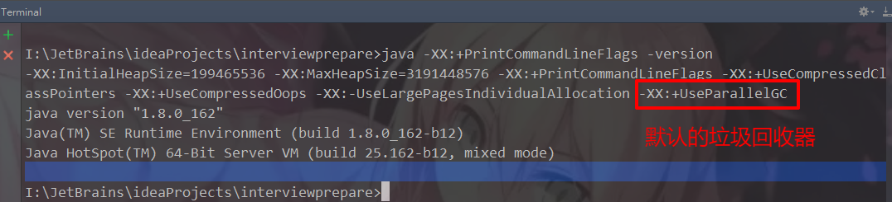
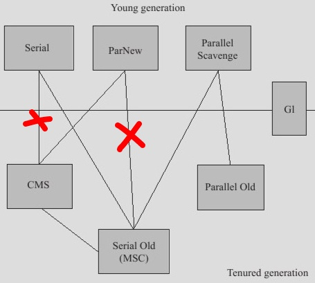
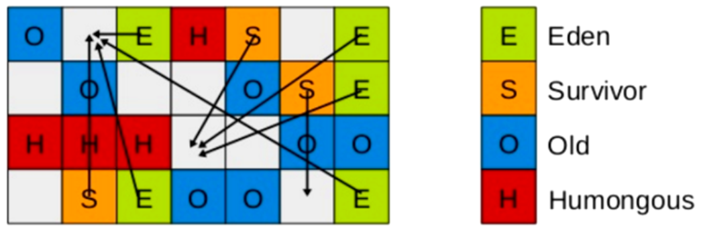

## 1.简单梳理
### [1].JVM体系概述

### [2].jdk1.7与jdk1.8：永久代改为元空间
### [3].GC作用域：方法区和堆（线程共享）
### [4].Java中常用的垃圾收集算法：
#### ①.引用计数：很少用
#### ②.复制算法：复制-清空-交换
###### 将可用内存按容量分成大小相等的两块，每次只使用其中一块，当这块内存使用完了，就将还存活的对象复制到另一块内存上去，然后把使用过的内存空间一次清理掉。这样使得每次都是对其中一块内存进行回收，内存分配时不用考虑内存碎片等复杂情况，只需要移动堆顶指针，按顺序分配内存即可，实现简单，运行高效。
###### 复制算法的缺点显而易见，可使用的内存降为原来一半。
#### ③.标记-清除算法：
###### 最基础的垃圾收集算法，算法分为“标记”和“清除”两个阶段：首先标记出所有需要回收的对象，在标记完成之后统一回收掉所有被标记的对象。标记-清除算法的缺点有两个：首先，效率问题，标记和清除效率都不高。其次，标记清除之后会产生大量的不连续的内存碎片，空间碎片太多会导致当程序需要为较大对象分配内存时无法找到足够的连续内存而不得不提前触发另一次垃圾收集动作。

#### ④.标记-整理算法：
###### 标记-整理算法在标记-清除算法基础上做了改进，标记阶段是相同的标记出所有需要回收的对象，在标记完成之后不是直接对可回收对象进行清理，而是让所有存活的对象都向一端移动，在移动过程中清理掉可回收的对象，这个过程叫做整理。
###### 标记-整理算法相比标记-清除算法的优点是内存被整理以后不会产生大量不连续内存碎片问题。
###### 复制算法在对象存活率高的情况下就要执行较多的复制操作，效率将会变低，而在对象存活率高的情况下使用标记-整理算法效率会大大提高。
#### ⑤.分代收集（将上述算法应用在不同的内存区域，复制主要用于新生代，标清标整主要用于老年代）：
###### 根据内存中对象的存活周期不同，将内存划分为几块，java的虚拟机中一般把内存划分为新生代和年老代，当新创建对象时一般在新生代中分配内存空间，当新生代垃圾收集器回收几次之后仍然存活的对象会被移动到年老代内存中，当大对象在新生代中无法找到足够的连续内存时也直接在年老代中创建。
## 2.JVM垃圾回收的时候如何确定是垃圾，什么是GC Root？
### [1].什么是垃圾？
###### 就是内存中已经不再使用到的空间就是垃圾
### [2].如何判断一个对象是否可以被回收？
#### ①.引用计数法
##### Java中，引用和对象是关联的，如果要操作对象则必须用引用进行，引用对象就是给对象添加一个引用计数器，每当有一个地方引用则+1，引用失效则-1，如果没有地方被使用，则被回收。其无法解决循环引用的问题，所以现在已经基本不用了
#### ②.根搜索路径算法（GCRoot）：枚举根节点做可达性分析
##### 为了解决循环引用问题，java使用了可达性分析的方法


##### 所谓GCRoot/TracingGC的根节点就是一组必须活跃的引用，基本思路就是通过一系列名为GC Roots的对象作为起始点，从这个被称为GCRoots的对象开始想下搜索，如果一个对象到GCRoots没有任何引用连接时，则说明此对象不可用，也即给定一个集合的应用作为根出发，通过引用关系遍历对象图，能被遍历到的（可到达的）对象就被判定为存活；没有被遍历到的就自然被判定为死亡，上图的对象C则将会被回收
### [3].哪些对象可以作为GCRoots？
#### ①.虚拟机栈（栈帧中的局部变量区，也叫做局部变量表）引用的对象
#### ②.方法中的静态属性引用对象
#### ③.方法中常量引用的对象
#### ④.本地方法栈中JNI（Native）引用的对象
## 3.如何查看JVM系统参数，JVM调优？
### [0].命令
#### ①.jinfo -flag 参数项 pid：查询指定参数项
#### ②.jinfo -flags pid：查询所有的jvm参数
### [1].参数类型
#### ①.标配参数：标准参数（-），所有的JVM实现都必须实现这些参数的功能，而且向后兼容；
    -version
    -help
    -showversion
#### ②.X参数：非标准参数（-X），默认jvm实现这些参数的功能，但是并不保证所有jvm实现都满足，且不保证向后兼容；
    -Xint：解释执行
    -Xcomp：第一次使用就编译成本地源码
    -Xmixed：混合模式
#### ③.XX参数：非Stable参数（-XX），此类参数各个jvm实现会有所不同，将来可能会随时取消，需要慎重使用；
    boolean类型
    KV设值类型
### [2].boolean类型
#### ①.公式：-XX:+或者-某个属性值
    +表示开启
    -表示关闭
#### ②.案例：查看是否打印GC收集信息
##### a.写一段代码，让其处于运行状态，这里为了测试，直接让线程睡眠并将其运行

##### b.在terminal中运行jps，查出进程id，在运行jinfo -flag PrintGCDetails pid

##### c.修改运行时参数，设置PrintGCDetails为开启

##### d.再次运行

### [3].设置值类型
#### ①.语法：-XX:属性key=属性value
#### ②.案例：查看metaspace默认值
##### a.jinfo -flag MetaspaceSize pid

##### b.调整运行时参数MetaspaceSize大小

##### c.再次运行，这个值虽然和设置的有一点偏差，应该是是由于换算单位或者其他原因引起的

#### ③.案例：查看年龄阈值

### [4].参数大全
#### ①查看
##### a.非标准参数（-X）可以通过java -X查看
##### b.-XX参数
    java -XX:+PrintFlagsInitial（查看初始默认值）
    java -XX:+PrintFlagsFinal (查看修改后的值，JVM修改或者认为修改，:代表修改过的值)

##### c.运行java的同时打出参数
```xml
public class J{
    public static void main(String[] args){
        System.out.println("aaaa");
    }
}
```
    运行java -XX:+PrintFlagsFinal -Xss128k J


    还比如java -XX:+PrintFlagsFinal -XX:MetaspaceSize=512M J
##### d.java -XX:+PrintCommandLineFlags -version

#### ②.关于jdk8
##### 在java8中，永久代已经被移除，被一个称为元空间的区域所取代，元空间的本质和永久代类似。
##### 元空间和永久代的区别在于：永久代使用的是JVM的堆内存，但是java8以后的元空间并不在虚拟机中，而是使用本机物理内存。因此在默认情况下，元空间的大小仅受到本地内存限制，类的原数据放入native memory，字符串池和类的静态变量放入java堆中，这样可以加载更多类的原数据就不再由MaxPermSize控制，而由系统的实际可用空间来控制，新生代和老年代比例默认1:2，伊甸园区和幸存者1区、幸存者1区比例默认为8:1:1，也即Eden:S0:S1:Old Memory = 8:1:1:20

#### ③.可通过程序查看当前参数
[通过程序查看当前参数](./code/GetJvmParam.java)
#### ④.常用参数
| 参数名称 | 含义 | 默认值 | 备注 |
| ----- | ----- | ----- | ----- |
| <span style="background-color:#737300">内存相关</span> | | | |
| -Xms | 等价于-XX:InitialHeapSize初始堆大小 | 物理内存的1/64(<1GB) | 默认(MinHeapFreeRatio参数可以调整)空余堆内存小于40%时，JVM就会增大堆直到-Xmx的最大限制.<br/><span style="color:red">建议和Xmx配成一样</span> |
| -Xmx | 等价于-XX:MaxHeapSize最大堆大小 | 物理内存的1/4(<1GB) | 默认(MaxHeapFreeRatio参数可以调整)空余堆内存大于70%时，JVM会减少堆直到 -Xms的最小限制。<br/>建议和Xms配成一样 |
| -Xmn | 年轻代大小 | 新生代和老年代比例默认1:2，伊甸园区和幸存者1区、幸存者1区比例默认为8:1:1，也即Eden:S0:S1:Old Memory = 8:1:1:20 | 注意：此处的大小是（eden+ 2 survivor space).与jmap -heap中显示的New gen是不同的。 |
| -XX:NewSize | 设置年轻代大小(for 1.3/1.4) |||
| -XX:MaxNewSize | 年轻代最大值(for 1.3/1.4) |||
| -XX:PermSize | 设置持久代(perm gen)初始值 | 物理内存的1/64 ||
| -XX:MaxPermSize | 设置持久代最大值 | 物理内存的1/4 ||
| -Xss | 每个线程的堆栈大小<br/>等价于-XX:ThreadStackSize | 512k~1024k<br/>官网原话：The default value depends on virtual memory. | JDK5.0以后每个线程堆栈大小为1M,以前每个线程堆栈大小为256K.更具应用的线程所需内存大小进行 调整.在相同物理内存下,减小这个值能生成更多的线程.但是操作系统对一个进程内的线程数还是有限制的,不能无限生成,经验值在3000~5000左右<br/>一般小的应用， 如果栈不是很深， 应该是128k够用的 大的应用建议使用256k。这个选项对性能影响比较大，需要严格的测试。<br/>和threadstacksize选项解释很类似，This option is equivalent to -XX:ThreadStackSize. |
| -XX:MetaspaceSize | 设置元空间的大小 | 默认大约20M左右 | 元空间的本质和永久代类似，都是对JVM规范中方法区的实现，不过元空间和永久代最大的区别在于：元空间并不在虚拟机中，而是使用本地内存。因此，默认情况下，元空间的大小仅受本地内存限制<br/>推荐设置-XX:MetaspaceSize=1024m |
| -XX:ThreadStackSize | Thread Stack Size |  | (0 means use default stack size) \[Sparc: 512; Solaris x86: 320 (was 256 prior in 5.0 and earlier); Sparc 64 bit: 1024; Linux amd64: 1024 (was 0 in 5.0 and earlier); all others 0.] |
| -XX:NewRatio | 年轻代(包括Eden和两个Survivor区)与年老代的比值(除去持久代) | 2 | -XX:NewRatio=4表示年轻代与年老代所占比值为1:4,年轻代占整个堆栈的1/5。<br/>Xms=Xmx并且设置了Xmn的情况下，该参数不需要进行设置。|
| -XX:SurvivorRatio | Eden区与Survivor区的大小比值 | 8 | 设置为8,则两个Survivor区与一个Eden区的比值为2:8,一个Survivor区占整个年轻代的1/10 |
| -XX:LargePageSizeInBytes | 内存页的大小不可设置过大， 会影响Perm的大小 |  | =128m |
| -XX:+UseFastAccessorMethods | 原始类型的快速优化 | | |
| -XX:+DisableExplicitGC | 关闭System.gc() |  | 这个参数需要严格的测试 |
| -XX:MaxTenuringThreshold | 垃圾最大年龄 |  |如果设置为0的话,则年轻代对象不经过Survivor区,直接进入年老代. 对于年老代比较多的应用,可以提高效率.如果将此值设置为一个较大值,则年轻代对象会在Survivor区进行多次复制,这样可以增加对象再年轻代的存活 时间,增加在年轻代即被回收的概率<br/>该参数只有在串行GC时才有效.|
| -XX:+AggressiveOpts | 加快编译 | | |
| -XX:+UseBiasedLocking | 锁机制的性能改善 | | |
| -Xnoclassgc | 禁用垃圾回收 | | |
| -XX:SoftRefLRUPolicyMSPerMB | 每兆堆空闲空间中SoftReference的存活时间 | 1s | softly reachable objects will remain alive for some amount of time after the last time they were referenced. The default value is one second of lifetime per free megabyte in the heap |
| -XX:PretenureSizeThreshold | 对象超过多大是直接在旧生代分配 | 0 |单位字节 新生代采用Parallel Scavenge GC时无效。<br/>另一种直接在旧生代分配的情况是大的数组对象,且数组中无外部引用对象。|
| -XX:TLABWasteTargetPercent | TLAB占eden区的百分比 | 1% | | 
| -XX:+CollectGen0First | FullGC时是否先YGC | FALSE | |
| -XX:+CollectGen0First | FullGC时是否先YGC | FALSE | |
| <span style="background-color:#5A5AAD">并行收集器相关参数</span> | | | |
| -XX:+UseParallelGC | Full GC采用parallel MSC |  | 选择垃圾收集器为并行收集器.此配置仅对年轻代有效.即上述配置下,年轻代使用并发收集,而年老代仍旧使用串行收集.(此项待验证) |
| -XX:+UseParNewGC | 设置年轻代为并行收集 | | 可与CMS收集同时使用。<br/>JDK5.0以上,JVM会根据系统配置自行设置,所以无需再设置此值|
| -XX:ParallelGCThreads | 并行收集器的线程数 | | 此值最好配置与处理器数目相等 同样适用于CMS |
| -XX:+UseParallelOldGC | 年老代垃圾收集方式为并行收集(Parallel Compacting) | | 这个是JAVA 6出现的参数选项 |
| -XX:MaxGCPauseMillis | 每次年轻代垃圾回收的最长时间(最大暂停时间) | | 如果无法满足此时间,JVM会自动调整年轻代大小,以满足此值。 |
| -XX:+UseAdaptiveSizePolicy | 自动选择年轻代区大小和相应的Survivor区比例 | | 设置此选项后,并行收集器会自动选择年轻代区大小和相应的Survivor区比例,以达到目标系统规定的最低相应时间或者收集频率等,此值建议使用并行收集器时,一直打开. |
| -XX:GCTimeRatio | 设置垃圾回收时间占程序运行时间的百分比 | | 公式为1/(1+n) |
| -XX:+ScavengeBeforeFullGC | Full GC前调用YGC | TRUE | Do young generation GC prior to a full GC. (Introduced in 1.4.1.) |
| <span style=" background-color:#F75000">CMS相关参数</span> | | | |
| XX:+UseConcMarkSweepGC | 使用CMS内存收集 | | 测试中配置这个以后,-XX:NewRatio=4的配置失效了,原因不明.所以,此时年轻代大小最好用-Xmn设置.??? |
| -XX:+AggressiveHeap | | |试图是使用大量的物理内存。<br/>长时间大内存使用的优化，能检查计算资源（内存， 处理器数量） 。<br/>至少需要256MB内存。<br/>大量的CPU／内存，（在1.4.1在4CPU的机器上已经显示有提升）|
| -XX:CMSFullGCsBeforeCompaction | 多少次后进行内存压缩 | | 由于并发收集器不对内存空间进行压缩,整理,所以运行一段时间以后会产生"碎片",使得运行效率降低.此值设置运行多少次GC以后对内存空间进行压缩,整理. |
| -XX:+CMSParallelRemarkEnabled | 降低标记停顿 | | |
| -XX+UseCMSCompactAtFullCollection | 在FULL GC的时候，对年老代的压缩 | | CMS是不会移动内存的， 因此， 这个非常容易产生碎片， 导致内存不够用， 因此， 内存的压缩这个时候就会被启用。 增加这个参数是个好习惯。<br/>可能会影响性能,但是可以消除碎片 |
| -XX:+UseCMSInitiatingOccupancyOnly | 使用手动定义初始化定义开始CMS收集 | | 禁止hostspot自行触发CMS GC |
| -XX:CMSInitiatingOccupancyFraction=70 | 使用cms作为垃圾回收<br/>使用70％后开始CMS收集 | 92 | 为了保证不出现promotion failed(见下面介绍)错误,该值的设置需要满足以下公式CMSInitiatingOccupancyFraction计算公式 |
| -XX:CMSInitiatingPermOccupancyFraction | 设置Perm Gen使用到达多少比率时触发 | 92 |  |
| -XX:+CMSIncrementalMode | 设置为增量模式 |  | 用于单CPU情况 |
| -XX:+CMSClassUnloadingEnabled | | | |
| <span style="background-color:#D9006C">辅助信息</span> | 
| -XX:+PrintGC | | | 输出形式:<br/>\[GC 118250K->113543K(130112K), 0.0094143 secs]<br/>\[Full GC 121376K->10414K(130112K), 0.0650971 secs]|
| -XX:+PrintGCDetails | 输出GC信息 |  | 输出形式:<br/>\[GC \[DefNew: 8614K->781K(9088K), 0.0123035 secs] 118250K->113543K(130112K), 0.0124633 secs]<br/>\[GC \[DefNew: 8614K->8614K(9088K), 0.0000665 secs]\[Tenured: 112761K->10414K(121024K), 0.0433488 secs] 121376K->10414K(130112K), 0.0436268 secs] |
| -XX:+PrintGCTimeStamps | | | | 
| -XX:+PrintGC:PrintGCTimeStamps | | | 可与-XX:+PrintGC -XX:+PrintGCDetails混合使用<br/>输出形式:<br/>11.851: \[GC 98328K->93620K(130112K), 0.0082960 secs]|
| -XX:+PrintGCApplicationStoppedTime | 打印垃圾回收期间程序暂停的时间.可与上面混合使用 | | 输出形式:Total time for which application threads were stopped: 0.0468229 seconds |
| -XX:+PrintGCApplicationConcurrentTime | 打印每次垃圾回收前,程序未中断的执行时间.可与上面混合使用 |  | 输出形式:Application time: 0.5291524 seconds |
| -XX:+PrintHeapAtGC | 打印GC前后的详细堆栈信息 | | |
| -Xloggc:filename | 把相关日志信息记录到文件以便分析.<br/>与上面几个配合使用 | | |
| -XX:+PrintClassHistogram | garbage collects before printing the histogram. | | |
| -XX:+PrintTLAB | 查看TLAB空间的使用情况 | 
| XX:+PrintTenuringDistribution | 查看每次minor GC后新的存活周期的阈值 | |  Desired survivor size 1048576 bytes, new threshold 7 (max 15)<br/>new threshold 7即标识新的存活周期的阈值为7。 |
| -XX:+HeapDumpBeforeFullGC | FullGC前后自动生成Dump | | |
| -XX:HeapDumpPath | dump目录 | | | 
#### ⑤.案例
    -Xms128m -Xmx4096m -Xss1024k -XX:MetaspaceSize=512m -XX:+PrintCommandLineFlags -XX:PrintGCDetails -XX:+UseSerialGC
#### ⑥.-XX:PrintGCDetails
##### a.代码
```java
public class PrintGCDetailsTest {
    public static void main(String[] args) {
        //声明一个20M的数组
        String[] strings = new String[20 * 1024 * 1024];
    }
}
```
##### b.运行参数
    -Xms10m -Xmx10m -XX:+PrintGCDetails
##### c.运行结果
```
[GC (Allocation Failure) [PSYoungGen: 1813K->488K(2560K)] 1813K->712K(9728K), 0.0041597 secs] [Times: user=0.00 sys=0.00, real=0.01 secs]
[GC (Allocation Failure) [PSYoungGen: 488K->488K(2560K)] 712K->712K(9728K), 0.0005748 secs] [Times: user=0.00 sys=0.00, real=0.00 secs]
[Full GC (Allocation Failure) [PSYoungGen: 488K->0K(2560K)] [ParOldGen: 224K->686K(7168K)] 712K->686K(9728K), [Metaspace: 3160K->3160K(1056768K)], 0.0150112 secs] [Times: user=0.00 sys=0.00, real=0.01 secs]
[GC (Allocation Failure) [PSYoungGen: 0K->0K(2560K)] 686K->686K(9728K), 0.0241911 secs] [Times: user=0.00 sys=0.00, real=0.02 secs]
[Full GC (Allocation Failure) [PSYoungGen: 0K->0K(2560K)] [ParOldGen: 686K->671K(7168K)] 686K->671K(9728K), [Metaspace: 3160K->3160K(1056768K)], 0.0405534 secs] [Times: user=0.00 sys=0.00, real=0.04 secs]
Heap
PSYoungGen      total 2560K, used 60K [0x00000000ffd00000, 0x0000000100000000, 0x0000000100000000)
  eden space 2048K, 2% used [0x00000000ffd00000,0x00000000ffd0f188,0x00000000fff00000)
  from space 512K, 0% used [0x00000000fff00000,0x00000000fff00000,0x00000000fff80000)
  to   space 512K, 0% used [0x00000000fff80000,0x00000000fff80000,0x0000000100000000)
ParOldGen       total 7168K, used 671K [0x00000000ff600000, 0x00000000ffd00000, 0x00000000ffd00000)
  object space 7168K, 9% used [0x00000000ff600000,0x00000000ff6a7fe8,0x00000000ffd00000)
Metaspace       used 3192K, capacity 4496K, committed 4864K, reserved 1056768K
  class space    used 348K, capacity 388K, committed 512K, reserved 1048576K
Exception in thread "main" java.lang.OutOfMemoryError: Java heap space
    at com.w4xj.interview.jvmgc.PrintGCDetailsTest.main(PrintGCDetailsTest.java:13)
```
##### d.GC（minorGC）分析示例（这里是网上找的图片，懒得手画了）

##### e.FullGC分析示例（这里是网上找的图片，懒得手画了）

##### f.规律：gc名称：gc前大小->GC后大小[该区域总大小]
#### ⑦.-XX:SurvivorRatio
##### a.设置新生代中Eden和s0/s1空间的比例，默认8:1:1
##### b.假如-XX:SurvivorRatio=4,Eden:s0:s1=4:1:1
##### c.s0/s1相同
#### ⑧.-XX:NewRatio
##### a.设置老年代和新生代空间的比例，默认2:1
##### b.假如-XX:NewRatio=2，新生代是1，老年代是2
#### ⑨.-XX:MaxTenuringThreshold
##### a.设置垃圾最大年龄
##### b.java8以前可以设置大些，让更多的对象死在新生代，减少fullGC次数
##### c.java8以后最大只能设置15
## 4.四大引用
### [1].架构

### [2].Reference：强引用（默认支持）
#### ①.当内存不足，JVM开始垃圾回收，对于强引用的对象，就算是出现了OOM也不会回收该对象
#### ②.强引用是我们最常见的普通对象引用，只要还有强引用指向一个对象，就表明对象还活着，垃圾回收器不会碰这种对象，在Java中最常见的就是强引用，把一个对象赋给一个引用变量，这个引用变量就是一个强引用，当一个对象被强引用变量引用时，它处于可达状态，它就是不可能被垃圾回收器回收的，即使该对象以后永远都不会被JVM回收。因此强引用是造成Java内存泄漏的主要原因之一。
#### ③.对于一个普通的对象，如果没有其他的引用关系，只要超过了引用的作用域或者显式地将相应的（强）引用赋值为null，一般认为就是一个可以被垃圾收集的了（当然具体还要看垃圾回收策略）
#### ④.示例
##### [强引用示例](./code/StrongReferenceGCTest.java)
### [3].软引用
#### ①.是一种相对强引用弱化了一些的引用，需要用java.lang.ref.SoftReference类来实现，可以让对象豁免一些垃圾收集
#### ②.对于只有软引用的对线来说
    当系统内存充足的时候，它不会被回收
    当系统内存不足时，它会被回收
#### ③.软引用通常用在对内存敏感的程序中，比如告诉缓存就用到软引用，内存够用的时候就保留，不够用就回收
#### ④.实例
##### a.代码
##### [软引用示例](./code/SoftReferenceGCTest.java)
##### b.运行参数-Xms10m -Xmx10m
##### c.运行结果
```
java.lang.Object@1540e19d
null
java.lang.Object@1540e19d
============================
java.lang.Object@677327b6
java.lang.OutOfMemoryError: Java heap space
    at com.w4xj.interview.jvmgc.SoftReferenceGC.notEnough(SoftReferenceGC.java:37)
    at com.w4xj.interview.jvmgc.SoftReferenceGC.main(SoftReferenceGC.java:16)
null
null
```
### [4].WeakReference：弱引用
#### ①.弱引用需要用java.lang.ref.WeakReference类来实现，它比软引用的生存期更短
#### ②.对于弱引用来说，只要垃圾回收机制一运行，不管JVM内存空间是否足够，都会回收该对象占用的内存
#### ③.案例
##### a.代码
##### [弱引用示例](./code/WeakReferenceGCTest.java)
##### b.运行效果
```
java.lang.Object@1540e19d
java.lang.Object@1540e19d
========================
null
```
### [5].软引用和弱引用的应用场景
#### ①.加入有一个应用需要读取大量的本地图片：
    如果每次读取图片都要从硬盘读取则会严重影响性能
    如果一次性全部加载到内存有可能造成内存溢出
#### ②.此时使用软引用可以解决这个问题，涉及思路
    用一个HashMap来保存图片的路径和相应图片对象关联的软引用之间的隐射关系，当内存不足时，JVM会自动回收这些缓存图片对象所占用的空间，从而有效地避免了OOM的问题
    Map<String,SoftReference<Bitmap>> imageCache = new HashMap<>();
### [6].WeakHashMap
#### ①.WeakHashMap

#### ②.代码
##### [WeakHashMap示例](./code/WeakHashMapTest.java)
#### ③.运行结果
```
{1=HashMap}
======================================
{}
```
### [7].引用队列
#### ①.代码
##### [引用队列示例](./code/WeakHashMapTest.java)
#### ②.运行结果
```
java.lang.Object@1540e19d
java.lang.Object@1540e19d
null
----------------------------
null
null
java.lang.ref.WeakReference@677327b6
```
### [8].虚引用
#### ①.“虚引用”顾名思义，就是形同虚设，与其他几种引用都不同，虚引用并不会决定对象的生命周期。在java中用java.lang.ref.PhantomReference类表示。如果一个对象仅持有虚引用，那么它就和没有任何引用一样，在任何时候都可能被垃圾回收。  虚引用主要用来跟踪对象被垃圾回收的活动。虚引用与软引用和弱引用的一个区别在于：虚引用必须和引用队列（ReferenceQueue）联合使用。
#### ②.虚引用的主要作用就是跟踪对象被垃圾回收的状态。仅仅是提供了一种确保对象被finalize以后，做某些事情的机制，PhantomReference的get方法总是返回null，因此无法访问对应的引用对象，其意义在于说明一个对象已经进入finalization阶段，可以被gc回收，用来实现币finalization机制更灵活的回收操作
#### ③.换句话说，设置虚引用关联的唯一目的，就是在这个对象被收集器回首的时候收到一个系统通知或者后续 添加进一步的处理。
#### ④.java技术允许使用finalize()方法在垃圾回收器将对象从内存中清除出去之前做必要的清理工作
#### ⑤.代码
##### [虚引用示例](./code/PhantomReferenceTest.java)
#### ⑥.执行结果
```
java.lang.Object@1540e19d
null
null
-----------------------
java.lang.Object@1540e19d
null
null
```
## 5.OOM？说几个异常（错误）？--千千万万别再只知道个NPE
### [1].java.lang.StackOverflowError
##### [虚引用示例](./code/StackOverflowErrorTest.java)
### [2].java.lang.OutOfMemoryError: java heap space
##### [虚引用示例](./code/JavaHeapSpaceTest.java)
### [3].java.lang.OutOfMemoryError: GC overhead limit exceeded
#### ①.GC回收时间过长会抛出OutOfMemoryError，过长的定义是：超过98%的时间用来做GC并且回收了不到2%的队内存，连续多次GC都只回收了不到2%的极端情况，假如不抛出GC overhead limit系统就会很快充满，然后在此GC，一直循环，导致CPU一直100%，而GC却没有效果

#### ②.代码
##### [GCOverHead示例](./code/GCOverHeadTest.java)
#### ③.运行参数-Xms12m -Xmx12m -XX:+PrintGCDetails -XX:MaxDirectMemorySize=5m，但实际上这个示例是有些坑的. 因为配置不同的堆内存大小, 选用不同的GC算法, 产生的错误信息也不相同。例如我测试参数为-Xms10m -Xmx10m时经常抛出的是java.lang.OutOfMemoryError: java heap space，这些真实的案例表明, 在资源受限的情况下, 无法准确预测程序会死于哪种具体的原因。所以在这类错误面前, 不能绑死某种特定的错误处理顺序。
#### ④.出现gc overhead的运行结果
```
[GC (Allocation Failure) [PSYoungGen: 3072K->488K(3584K)] 3072K->1634K(11776K), 0.0026518 secs] [Times: user=0.00 sys=0.00, real=0.00 secs]
[GC (Allocation Failure) [PSYoungGen: 3560K->504K(3584K)] 4706K->4348K(11776K), 0.0042487 secs] [Times: user=0.03 sys=0.00, real=0.00 secs]
[GC (Allocation Failure) [PSYoungGen: 3503K->512K(3584K)] 7348K->7301K(11776K), 0.0060182 secs] [Times: user=0.03 sys=0.00, real=0.01 secs]
[Full GC (Ergonomics) [PSYoungGen: 512K->0K(3584K)] [ParOldGen: 6789K->6898K(8192K)] 7301K->6898K(11776K), [Metaspace: 3451K->3451K(1056768K)], 0.0892483 secs] [Times: user=0.09 sys=0.00, real=0.09 secs]
[Full GC (Ergonomics) [PSYoungGen: 3072K->1534K(3584K)] [ParOldGen: 6898K->7955K(8192K)] 9970K->9490K(11776K), [Metaspace: 3451K->3451K(1056768K)], 0.0587188 secs] [Times: user=0.05 sys=0.00, real=0.06 secs]
....
i: 174777
[Full GC (Ergonomics) [PSYoungGen: 3072K->0K(3584K)] [ParOldGen: 8068K->711K(8192K)] 11140K->711K(11776K), [Metaspace: 3475K->3475K(1056768K)], 0.0059712 secs] [Times: user=0.00 sys=0.00, real=0.01 secs]
Heap
PSYoungGen      total 3584K, used 77K [0x00000000ffc00000, 0x0000000100000000, 0x0000000100000000)
  eden space 3072K, 2% used [0x00000000ffc00000,0x00000000ffc13490,0x00000000fff00000)
  from space 512K, 0% used [0x00000000fff00000,0x00000000fff00000,0x00000000fff80000)
  to   space 512K, 0% used [0x00000000fff80000,0x00000000fff80000,0x0000000100000000)
ParOldGen       total 8192K, used 711K [0x00000000ff400000, 0x00000000ffc00000, 0x00000000ffc00000)
  object space 8192K, 8% used [0x00000000ff400000,0x00000000ff4b1e98,0x00000000ffc00000)
Metaspace       used 3482K, capacity 4500K, committed 4864K, reserved 1056768K
  class space    used 379K, capacity 388K, committed 512K, reserved 1048576K
java.lang.OutOfMemoryError: GC overhead limit exceeded
    at java.lang.Integer.toString(Integer.java:403)
    at java.lang.String.valueOf(String.java:3099)
    at indi.w4xj.jvm.code.GCOverHead.main(GCOverHead.java:19)
```
### [4].java.lang.OutOfMemoryError: Direct buffer memory
#### ①.直接内存溢出，导致原因：写nio程序经常使用ByteBuffer来读取或者写入数据，这是一种基于通道（Chanel）与缓冲区（Buffer）的I/O方式，他可以使用native函数库直接分配对外内存，然后通过一个存储在java堆里面的DirectByteBuffer对象作为这块内存的引用进行操作，这样能在一些场景中显著提升性能，因为避免了在java堆和native堆中来回复制数据
#### ②.ByteBuffer.allocate(capability)第一种方式就是分配jvm堆内存，属于gc范畴，由于需要拷贝，所以速度相对较慢
#### ③.ByteBuffer.allocateDirect(capability)第二种方式就是直接分配os本地内存，不属于gC范畴，由于不需要内存拷贝，所以速度较快
#### ④.但如果不断分配本地内存，堆内存很少使用，那么JVM就不需要执行GC，DirectByteBuffer对象就不会被回收，这时候堆内存充足，但本地内存可能已经耗尽，再次尝试分配本地内存就会出现OutOfMemoryError，程序直接奔溃
#### ⑤.代码演示
[DirectBufferMemory示例](./code/DirectBufferMemoryTest.java)
#### ⑥.运行参数
    -XX:MaxDirectMemorySize=5m
#### ⑦.运行结果
```
maxDirectMemory: 5.0MB
Exception in thread "main" java.lang.OutOfMemoryError: Direct buffer memory
    at java.nio.Bits.reserveMemory(Bits.java:694)
    at java.nio.DirectByteBuffer.<init>(DirectByteBuffer.java:123)
    at java.nio.ByteBuffer.allocateDirect(ByteBuffer.java:311)
    at indi.w4xj.jvm.code.DirectBufferMemory.main(DirectBufferMemory.java:19)
```
### [5].java.lang.OutOfMemoryError: unable to create new native thread
#### ①.高并发请求服务器时，经常出现如下异常：java.lang.OutOfMemoryError: unable to to create new native thread
#### ②.准确的讲该native thread 异常与对应的平台有关
#### ③导致原因
##### a.应用创建了太多的线程，一个应用京城创建多个线程，超过系统承载基线
##### b.服务器并不允许应用程序创建这么多线程，linux系统默认允许单个线程可以创建的线程数是1024个，如果超过这个数量，就会报java.lang.OutOfMemoryError: unable to create new native thread
#### ④.非root用户：默认1024，root用户默认无上限，可通过ulimit -u查看
#### ⑤.操作系统限制 系统最大可开线程数，主要受以下几个参数影响
##### a./proc/sys/kernel/pid_max
##### b./proc/sys/kernel/thread-max
##### c.max_user_process（ulimit -u）
###### 在64位Linux系统（CentOS 6， 3G内存）下测试，发现还有一个参数是会限制线程数量：max user process（可通过ulimit –a查看，默认值1024，通过ulimit –u可以修改此值），这个值在上面的32位Ubuntu测试环境下并无限制
##### d./proc/sys/vm/max_map_count
#### ⑥.设置最大线程数
##### a.查看：/etc/security/limits.d/90-nproc.conf，我们发现root是unlimited，其他用户是1024

##### b.若确实需要扩展线程数，可以末尾新增一行
#### ⑦.测试代码
##### [UnableToCreateNewNativeThread示例](./code/UnableToCreateNewNativeThreadTest.java)
### [6].java.lang.OutOfMemoryError: Metaspace
#### ①.查看默认元空间大小java -XX:+PrintFlagsInitial，约等于20M

#### ②.Java8及之后版本用Metaspace代替永久代。Metaspace是方法区在Hotspot中 的实现，他与永久代的最大区别就是不实用jvm内存，而是使用本地内存，也即在java8中，class metadata（the virtual mechines internal presentation of java class）被存储在叫做Metaspace的native memory
#### ③.永久代存放以下信息：
    虚拟机加载的类信息
    常量池
    静态变量
    即时编译后的代码
#### ④.为了测试效果，引入cglib
```xml
<dependency>
    <groupId>cglib</groupId>
    <artifactId>cglib</artifactId>
    <version>2.2.2</version>
</dependency>
```
#### ⑤.代码
[OOMMetaspace示例](./code/OOMMetaspaceTest.java)
#### ⑥.运行参数
```
    -XX:MetaspaceSize=10m -XX:MaxMetaspaceSize=10m
```
#### ⑦.运行模拟
```
第332次
java.lang.OutOfMemoryError: Metaspace
```
## 6.垃圾回收算法，垃圾回收器？
### [1].垃圾回收算法主要就是前面谈到的引用计数、复制算法、标记清除、标记压缩（标记整理），分代整理即在不同的内存区域使用不同算法（目前还没有一个完美通用的算法），复制算法用于新生代，标清、标整用于老年代
### [2].四类（后面介绍其衍生的7种垃圾回收器）主要的垃圾回收器
#### ①.Serial：串行垃圾回收器
#### ②.Parallel：并行垃圾回收器
#### ③.CMS：并发垃圾回收器
#### ④.G1：G1垃圾回收器
### [3].Serial：串行垃圾回收器
    它为单线程环境设计且只使用一个线程进行垃圾回收，会暂停所有的用户线程，所以不适合做服务器环境
### [4].Parallel：并行垃圾回收器
    多个垃圾收集线程并行工作，此时用户线程是暂停的，适用于科学计算/大数据后台处理首台处理等弱交互场景
### [5].CMS（Concurrent Mark Sweep）：并发垃圾回收器
    用户线程和垃圾收集线程同时执行（不一定是并行，可能交替执行），不需要停顿用户线程，互联网公司多用它，适用对响应时间有要求的场景
### [6].STW(Stop-the-world) vs CMS（并发）
    STW（并行和串行都属于STW）：暂停整个应用，时间可能会很长
    CMS：更为复杂，GC可能会抢占应用的CPU
### [7].G1：Garbage First
#### ①.Java8诞生，java9默认垃圾回收器就是G1，java11默认为更高版本的ZGC
#### ②.G1垃圾回收器将对内存分割成不同的区域然后并发的对其进行垃圾回收
## 7.怎么查看服务器默认的垃圾收集器是哪个，生产上如何配置，谈谈对垃圾收集器的理解？
### [1].查看默认的垃圾回收器：java -XX:+PrintCommandLineFlags -version

### [2].默认的垃圾回收器有哪些
#### ①.UseSeralGC
#### ②.UseSeralOldGC（废弃）
#### ③.UseParallelGC
#### ④.UseConcMarkSweepGC
#### ⑤.UseParNewGC
#### ⑥.UseParallelOldGC
#### ⑦.UseG1GC

#### 红色表示java8开始，对应的垃圾收集器Deprecated，不推荐使用

### [3].参数说明
    DefNew：default new generation
    Tenured：old
    ParNew：Parallel New Generation
    PSYoungGen：Parallel Scavenge Young Generation
    ParOldGen：Parallel Old Generation
### [4].JVM的Server/client模式
#### ①.适用范围：只需要掌握Server模式即可，client模式不会用
#### ②.32位windows操作系统，无论硬件如何都默认client模式
#### ③.32位其他操作系统，2G内存同时有2个cpu以上用Server模式，低于该配置也是client模式
#### ④.64位只支持server模式
### [5].新生代
#### ①.串行GC(Serial)/(Serial Copying)
##### a.一句话：一个单线程的收集器，在进行垃圾收集时候，必须暂停其他所有的工作线程直到它收集结束

##### b.串行收集器是最古老的，最稳定以及效率最高的收集器，只使用一个线程去收但其在进行垃圾收集过程中可能会产生叫长的停顿（Stop-the-world）。虽然在收集垃圾过程中需要暂停所有其他的工作线程，但是它简单高效，对于限定单个CPU环境来说，没有线程交互的开销可以获得最高的单线程垃圾收集效率，因此Serial垃圾收集器依然是java虚拟机运行在Client模式下默认的新生代垃圾收集器
##### c.对应JVM参数是：-XX:+UseSerialGC，开启后会使用：Serial（Young区用）+Serial Old（Old区用）的收集器组合，“捆绑销售”，新生代用复制算法，老年代使用标记整理（压缩）算法
##### d.代码
[串行GC示例](./code/OOMMetaspaceTest.java)
##### e.运行参数
    -Xms10m -Xmx10m -XX:+PrintGCDetails -XX:+PrintCommandLineFlags -XX:+UseSerialGC
##### f.运行效果
```
-XX:InitialHeapSize=10485760 -XX:MaxHeapSize=10485760 -XX:+PrintCommandLineFlags -XX:+PrintGCDetails -XX:+UseCompressedClassPointers -XX:+UseCompressedOops -XX:-UseLargePagesIndividualAllocation -XX:+UseSerialGC
[GC (Allocation Failure) [DefNew: 2752K->319K(3072K), 0.0019639 secs] 2752K->853K(9920K), 0.0019923 secs] [Times: user=0.00 sys=0.00, real=0.00 secs]
[GC (Allocation Failure) [DefNew: 2982K->171K(3072K), 0.0009854 secs] 3516K->1365K(9920K), 0.0010054 secs] [Times: user=0.00 sys=0.00, real=0.00 secs]
[GC (Allocation Failure) [DefNew: 2276K->171K(3072K), 0.0006409 secs] 3470K->2220K(9920K), 0.0006672 secs] [Times: user=0.00 sys=0.00, real=0.00 secs]
[GC (Allocation Failure) [DefNew: 2277K->0K(3072K), 0.0008651 secs] 4327K->3589K(9920K), 0.0008839 secs] [Times: user=0.00 sys=0.00, real=0.00 secs]
[GC (Allocation Failure) [DefNew: 1422K->0K(3072K), 0.0007674 secs] 5012K->4959K(9920K), 0.0007862 secs] [Times: user=0.00 sys=0.00, real=0.00 secs]
[GC (Allocation Failure) [DefNew: 1422K->0K(3072K), 0.0008165 secs] 6382K->6329K(9920K), 0.0008335 secs] [Times: user=0.00 sys=0.00, real=0.00 secs]
[GC (Allocation Failure) [DefNew: 2752K->2752K(3072K), 0.0000083 secs][Tenured: 6328K->4276K(6848K), 0.0026543 secs] 9081K->4276K(9920K), [Metaspace: 3986K->3986K(1056768K)], 0.0026945 secs] [Times: user=0.00 sys=0.00, real=0.00 secs]
[GC (Allocation Failure) [DefNew: 1423K->0K(3072K), 0.0004223 secs] 5699K->5646K(9920K), 0.0004412 secs] [Times: user=0.00 sys=0.00, real=0.00 secs]
[GC (Allocation Failure) [DefNew: 1423K->1423K(3072K), 0.0000099 secs][Tenured: 5646K->3592K(6848K), 0.0024846 secs] 7069K->3592K(9920K), [Metaspace: 3986K->3986K(1056768K)], 0.0025235 secs] [Times: user=0.00 sys=0.00, real=0.00 secs]
[GC (Allocation Failure) [DefNew: 2752K->0K(3072K), 0.0006112 secs] 6344K->6331K(9920K), 0.0006267 secs] [Times: user=0.00 sys=0.00, real=0.00 secs]
[GC (Allocation Failure) [DefNew: 53K->0K(3072K), 0.0001908 secs][Tenured: 6331K->4961K(6848K), 0.0023665 secs] 6384K->4961K(9920K), [Metaspace: 3986K->3986K(1056768K)], 0.0025807 secs] [Times: user=0.00 sys=0.00, real=0.00 secs]
[Full GC (Allocation Failure) [Tenured: 4961K->4932K(6848K), 0.0027576 secs] 4961K->4932K(9920K), [Metaspace: 3986K->3986K(1056768K)], 0.0027755 secs] [Times: user=0.00 sys=0.00, real=0.00 secs]
Heap
def new generation   total 3072K, used 108K [0x00000000ff600000, 0x00000000ff950000, 0x00000000ff950000)
  eden space 2752K,   3% used [0x00000000ff600000, 0x00000000ff61b2d0, 0x00000000ff8b0000)
  from space 320K,   0% used [0x00000000ff900000, 0x00000000ff900000, 0x00000000ff950000)
  to   space 320K,   0% used [0x00000000ff8b0000, 0x00000000ff8b0000, 0x00000000ff900000)
tenured generation   total 6848K, used 4932K [0x00000000ff950000, 0x0000000100000000, 0x0000000100000000)
   the space 6848K,  72% used [0x00000000ff950000, 0x00000000ffe21098, 0x00000000ffe21200, 0x0000000100000000)
Metaspace       used 4018K, capacity 4568K, committed 4864K, reserved 1056768K
  class space    used 443K, capacity 460K, committed 512K, reserved 1048576K
Exception in thread "main" java.lang.OutOfMemoryError: Java heap space
    at java.util.Arrays.copyOf(Arrays.java:3332)
    at java.lang.AbstractStringBuilder.ensureCapacityInternal(AbstractStringBuilder.java:124)
    at java.lang.AbstractStringBuilder.append(AbstractStringBuilder.java:448)
    at java.lang.StringBuilder.append(StringBuilder.java:136)
    at com.w4xj.interview.jvmgc.GCTest.main(GCTest.java:17)

Process finished with exit code 1
```
#### ②.并行GC(ParNew)
##### a.一句话：使用多线程进行垃圾回收，在垃圾收集时，会Stop-the-world暂停其他所有的工作线程直到它收集结束

##### b.ParNew收集器其实就是Serial收集器新生代的并行多线程版本，最常用的应用场景就是配合老年代的CMS GC工作，其余的行为和Serial收集器完全一样，ParNew收集器在垃圾手机过程中同样也要暂停所有其他的工作线程。他是很多java虚拟机运行在Server模式下新生代的默认垃圾收集器
##### c.对应的JVM参数：-XX:UseParNewGC 启用ParNew收集器，值影响新生代的收集，不影响老年代，开启参数后，会使用ParNew（young区用）+ Serial Old（老年代用）的收集器组合，新生代使用复制算法，老年代使用标记-整理算法
##### d.已寄回使用上面代码，运行参数-Xms10m -Xmx10m -XX:+PrintGCDetails -XX:+PrintCommandLineFlags -XX:+UseParNewGC
##### e.运行结果
```
-XX:InitialHeapSize=10485760 -XX:MaxHeapSize=10485760 -XX:+PrintCommandLineFlags -XX:+PrintGCDetails -XX:+UseCompressedClassPointers -XX:+UseCompressedOops -XX:-UseLargePagesIndividualAllocation -XX:+UseParNewGC
Exception in thread "main" java.lang.OutOfMemoryError: Java heap space
    at java.util.Arrays.copyOf(Arrays.java:3332)
    at java.lang.AbstractStringBuilder.ensureCapacityInternal(AbstractStringBuilder.java:124)
    at java.lang.AbstractStringBuilder.append(AbstractStringBuilder.java:448)
    at java.lang.StringBuilder.append(StringBuilder.java:136)
    at com.w4xj.interview.jvmgc.GCTest.main(GCTest.java:23)
[GC (Allocation Failure) [ParNew: 2752K->320K(3072K), 0.0013916 secs] 2752K->866K(9920K), 0.0021825 secs] [Times: user=0.00 sys=0.00, real=0.00 secs]
[GC (Allocation Failure) [ParNew: 2990K->320K(3072K), 0.0024493 secs] 3537K->1529K(9920K), 0.0024737 secs] [Times: user=0.00 sys=0.00, real=0.00 secs]
[GC (Allocation Failure) [ParNew: 2425K->231K(3072K), 0.0006907 secs] 3634K->2298K(9920K), 0.0007102 secs] [Times: user=0.00 sys=0.00, real=0.00 secs]
[GC (Allocation Failure) [ParNew: 2337K->30K(3072K), 0.0006419 secs] 4404K->3645K(9920K), 0.0006579 secs] [Times: user=0.00 sys=0.00, real=0.00 secs]
[GC (Allocation Failure) [ParNew: 1452K->3K(3072K), 0.0007763 secs] 5067K->4988K(9920K), 0.0007952 secs] [Times: user=0.00 sys=0.00, real=0.00 secs]
[GC (Allocation Failure) [ParNew (promotion failed): 1426K->1426K(3072K), 0.0006323 secs][Tenured: 6353K->2922K(6848K), 0.0025424 secs] 6410K->2922K(9920K), [Metaspace: 3985K->3985K(1056768K)], 0.0033858 secs] [Times: user=0.00 sys=0.00, real=0.00 secs]
[GC (Allocation Failure) [ParNew (promotion failed): 2752K->2756K(3072K), 0.0005503 secs][Tenured: 5660K->4291K(6848K), 0.0025526 secs] 5674K->4291K(9920K), [Metaspace: 3985K->3985K(1056768K)], 0.0031335 secs] [Times: user=0.02 sys=0.00, real=0.00 secs]
[GC (Allocation Failure) [ParNew: 1478K->2K(3072K), 0.0004471 secs] 5769K->5662K(9920K), 0.0004734 secs] [Times: user=0.00 sys=0.00, real=0.00 secs]
[GC (Allocation Failure) [ParNew: 1424K->1424K(3072K), 0.0000087 secs][Tenured: 5660K->3607K(6848K), 0.0025019 secs] 7084K->3607K(9920K), [Metaspace: 3985K->3985K(1056768K)], 0.0025368 secs] [Times: user=0.00 sys=0.00, real=0.00 secs]
[GC (Allocation Failure) [ParNew (promotion failed): 2752K->2756K(3072K), 0.0005302 secs][Tenured: 6345K->4951K(6848K), 0.0029885 secs] 6359K->4951K(9920K), [Metaspace: 3985K->3985K(1056768K)], 0.0035478 secs] [Times: user=0.00 sys=0.00, real=0.00 secs]
[Full GC (Allocation Failure) [Tenured: 4951K->4931K(6848K), 0.0028720 secs] 4951K->4931K(9920K), [Metaspace: 3985K->3985K(1056768K)], 0.0028905 secs] [Times: user=0.02 sys=0.00, real=0.00 secs]
Heap
par new generation   total 3072K, used 108K [0x00000000ff600000, 0x00000000ff950000, 0x00000000ff950000)
  eden space 2752K,   3% used [0x00000000ff600000, 0x00000000ff61b3c0, 0x00000000ff8b0000)
  from space 320K,   0% used [0x00000000ff900000, 0x00000000ff900000, 0x00000000ff950000)
  to   space 320K,   0% used [0x00000000ff8b0000, 0x00000000ff8b0000, 0x00000000ff900000)
tenured generation   total 6848K, used 4931K [0x00000000ff950000, 0x0000000100000000, 0x0000000100000000)
   the space 6848K,  72% used [0x00000000ff950000, 0x00000000ffe20d98, 0x00000000ffe20e00, 0x0000000100000000)
Metaspace       used 4017K, capacity 4568K, committed 4864K, reserved 1056768K
  class space    used 443K, capacity 460K, committed 512K, reserved 1048576K
Java HotSpot(TM) 64-Bit Server VM warning: Using the ParNew young collector with the Serial old collector is deprecated and will likely be removed in a future release


Process finished with exit code 1
```
#### ③.并行回收GC(Parallel)/(Parallel Scavenge)
##### a.一句话：串行收集器在新生代和老年代的并行化

##### b.Parallel Scavenge收集器类似ParNew也是一个新生代垃圾收集器，使用复制算法，也会一个并行多线程垃圾收集器，俗称吞吐量优先收集器。
##### c.它关注的重点是
###### i.可控制的吞吐量（Thoughput=运行用户代码时间/（运行用户代码时间+垃圾收集时间），也即比如程序运行100分钟，垃圾回收1分钟，吞吐量就是99%）。高吞吐量意味着高效利用CPU的时间，它用于在后台运算而不需要太多交互的任务
###### ii.自适应调节策略也是ParallelScavenge收集器与ParNew收集器的一个重要区别。自适应调节策略：虚拟机会根据当前系统的运行情况收集性能监控信息，动态跳帧过这些参数以提供最合适的停顿时间（-XX:MaxGCPauseMillis）或最大的吞吐量
##### d.常用JVM参数：-XX:UseParallelGC或-XX:UseParallelOldGC可相互激活使用Parallel Scanvenge收集器，开启该参数后：新生代使用复制算法，老年代使用标记-整理算法
##### e.-XX:ParallelGCThreads=数字N 表示启动多少额GC线程
    CPU > 8    N = 5/8
    CPU < 8    N = 实际个数
##### f.运行结果
```
-XX:InitialHeapSize=10485760 -XX:MaxHeapSize=10485760 -XX:+PrintCommandLineFlags -XX:+PrintGCDetails -XX:+UseCompressedClassPointers -XX:+UseCompressedOops -XX:-UseLargePagesIndividualAllocation -XX:+UseParallelGC
[GC (Allocation Failure) [PSYoungGen: 2048K->488K(2560K)] 2048K->764K(9728K), 0.0028695 secs] [Times: user=0.00 sys=0.00, real=0.00 secs]
[GC (Allocation Failure) [PSYoungGen: 2534K->492K(2560K)] 2810K->921K(9728K), 0.0014871 secs] [Times: user=0.00 sys=0.00, real=0.00 secs]
[GC (Allocation Failure) [PSYoungGen: 2417K->456K(2560K)] 2845K->1393K(9728K), 0.0014374 secs] [Times: user=0.00 sys=0.00, real=0.00 secs]
[GC (Allocation Failure) [PSYoungGen: 1854K->472K(2560K)] 2791K->2089K(9728K), 0.0015947 secs] [Times: user=0.00 sys=0.00, real=0.00 secs]
[GC (Allocation Failure) [PSYoungGen: 1871K->472K(2560K)] 4847K->4127K(9728K), 0.0006647 secs] [Times: user=0.00 sys=0.00, real=0.00 secs]
[GC (Allocation Failure) [PSYoungGen: 1191K->472K(1536K)] 6207K->5487K(8704K), 0.0025918 secs] [Times: user=0.00 sys=0.00, real=0.00 secs]
[GC (Allocation Failure) [PSYoungGen: 472K->32K(2048K)] 5487K->5503K(9216K), 0.0026138 secs] [Times: user=0.00 sys=0.00, real=0.00 secs]
[Full GC (Allocation Failure) [PSYoungGen: 32K->0K(2048K)] [ParOldGen: 5471K->2888K(7168K)] 5503K->2888K(9216K), [Metaspace: 3989K->3989K(1056768K)], 0.0073860 secs] [Times: user=0.00 sys=0.00, real=0.01 secs]
[GC (Allocation Failure) [PSYoungGen: 20K->32K(2048K)] 6987K->6999K(9216K), 0.0005540 secs] [Times: user=0.00 sys=0.00, real=0.00 secs]
[Full GC (Ergonomics) [PSYoungGen: 32K->0K(2048K)] [ParOldGen: 6967K->2203K(7168K)] 6999K->2203K(9216K), [Metaspace: 3989K->3989K(1056768K)], 0.0069899 secs] [Times: user=0.00 sys=0.00, real=0.01 secs]
[GC (Allocation Failure) [PSYoungGen: 40K->32K(2048K)] 6322K->6313K(9216K), 0.0004678 secs] [Times: user=0.00 sys=0.00, real=0.00 secs]
[Full GC (Ergonomics) [PSYoungGen: 32K->0K(2048K)] [ParOldGen: 6281K->4922K(7168K)] 6313K->4922K(9216K), [Metaspace: 3989K->3989K(1056768K)], 0.0072082 secs] [Times: user=0.02 sys=0.00, real=0.01 secs]
[GC (Allocation Failure) [PSYoungGen: 0K->0K(2048K)] 4922K->4922K(9216K), 0.0002702 secs] [Times: user=0.00 sys=0.00, real=0.00 secs]
[Full GC (Allocation Failure) [PSYoungGen: 0K->0K(2048K)] [ParOldGen: 4922K->4901K(7168K)] 4922K->4901K(9216K), [Metaspace: 3989K->3989K(1056768K)], 0.0075331 secs] [Times: user=0.00 sys=0.00, real=0.01 secs]
Heap
PSYoungGen      total 2048K, used 61K [0x00000000ffd00000, 0x0000000100000000, 0x0000000100000000)
  eden space 1024K, 5% used [0x00000000ffd00000,0x00000000ffd0f480,0x00000000ffe00000)
  from space 1024K, 0% used [0x00000000fff00000,0x00000000fff00000,0x0000000100000000)
  to   space 1024K, 0% used [0x00000000ffe00000,0x00000000ffe00000,0x00000000fff00000)
ParOldGen       total 7168K, used 4901K [0x00000000ff600000, 0x00000000ffd00000, 0x00000000ffd00000)
  object space 7168K, 68% used [0x00000000ff600000,0x00000000ffac9750,0x00000000ffd00000)
Metaspace       used 4021K, capacity 4568K, committed 4864K, reserved 1056768K
  class space    used 443K, capacity 460K, committed 512K, reserved 1048576K
Exception in thread "main" java.lang.OutOfMemoryError: Java heap space
    at java.util.Arrays.copyOf(Arrays.java:3332)
    at java.lang.AbstractStringBuilder.ensureCapacityInternal(AbstractStringBuilder.java:124)
    at java.lang.AbstractStringBuilder.append(AbstractStringBuilder.java:448)
    at java.lang.StringBuilder.append(StringBuilder.java:136)
    at com.w4xj.interview.jvmgc.GCTest.main(GCTest.java:25)

Process finished with exit code 1
```
### [6].老年代
#### ①.并行GC（Parallel Old）/（Parallel MSC）
##### a.Parallel Old收集器是Parallel Scavenge的老年代版本，使用多线程的标记整理算法，Parallel Old收集器在jdk1.6才开始提供。
##### b.在jdk1.6之前，新生代使用ParallelScavenge收集器只能搭配老年代的Serial Old收集器，只能保证新生代的吞吐量优先，无法保证整体的吞吐量，在jdk1.6之前是Parallel Scavenge + Serial Old
##### c.Parallel Old正式为了在老年代同样提供吞吐量优先的垃圾收集器，如果系统对吞吐量要求比较高，jdk1.8以后可以优先考虑新生代Parallel Scavenge和老年代Parallel Old收集器的搭配策略，在Jdk1.8及后用Parallel Scavenge + Parallel Old
##### d.JVM常用参数  -XX:+UseParallelOldGC 使用Parallel Old收集器，将自动激活新生代的Parallel Scavenge
##### e.运行参数-Xms10m -Xmx10m -XX:+PrintGCDetails -XX:+PrintCommandLineFlags -XX:+UseParallelOldGC
##### f.运行效果
```
-XX:InitialHeapSize=10485760 -XX:MaxHeapSize=10485760 -XX:+PrintCommandLineFlags -XX:+PrintGCDetails -XX:+UseCompressedClassPointers -XX:+UseCompressedOops -XX:-UseLargePagesIndividualAllocation -XX:+UseParallelOldGC
[GC (Allocation Failure) [PSYoungGen: 2048K->488K(2560K)] 2048K->752K(9728K), 0.0012457 secs] [Times: user=0.03 sys=0.00, real=0.00 secs]
[GC (Allocation Failure) [PSYoungGen: 2536K->504K(2560K)] 2800K->920K(9728K), 0.0010395 secs] [Times: user=0.00 sys=0.00, real=0.00 secs]
[GC (Allocation Failure) [PSYoungGen: 2451K->504K(2560K)] 2867K->1429K(9728K), 0.0047709 secs] [Times: user=0.00 sys=0.00, real=0.00 secs]
[GC (Allocation Failure) [PSYoungGen: 1903K->504K(2560K)] 2829K->2110K(9728K), 0.0044781 secs] [Times: user=0.01 sys=0.00, real=0.00 secs]
[GC (Allocation Failure) [PSYoungGen: 1904K->504K(2560K)] 4870K->4150K(9728K), 0.0682262 secs] [Times: user=0.00 sys=0.00, real=0.07 secs]
[GC (Allocation Failure) [PSYoungGen: 1224K->504K(1536K)] 6231K->5518K(8704K), 0.0010741 secs] [Times: user=0.02 sys=0.00, real=0.00 secs]
[GC (Allocation Failure) [PSYoungGen: 504K->32K(2048K)] 5518K->5518K(9216K), 0.0022385 secs] [Times: user=0.00 sys=0.00, real=0.00 secs]
[Full GC (Allocation Failure) [PSYoungGen: 32K->0K(2048K)] [ParOldGen: 5486K->2884K(7168K)] 5518K->2884K(9216K), [Metaspace: 3987K->3987K(1056768K)], 0.0077811 secs] [Times: user=0.00 sys=0.00, real=0.01 secs]
[GC (Allocation Failure) [PSYoungGen: 40K->32K(2048K)] 7006K->6998K(9216K), 0.0003030 secs] [Times: user=0.00 sys=0.00, real=0.00 secs]
[Full GC (Ergonomics) [PSYoungGen: 32K->0K(2048K)] [ParOldGen: 6966K->2204K(7168K)] 6998K->2204K(9216K), [Metaspace: 3987K->3987K(1056768K)], 0.0144068 secs] [Times: user=0.03 sys=0.00, real=0.01 secs]
[GC (Allocation Failure) [PSYoungGen: 20K->32K(2048K)] 6306K->6318K(9216K), 0.0003321 secs] [Times: user=0.02 sys=0.00, real=0.00 secs]
[Full GC (Ergonomics) [PSYoungGen: 32K->0K(2048K)] [ParOldGen: 6286K->4925K(7168K)] 6318K->4925K(9216K), [Metaspace: 3987K->3987K(1056768K)], 0.0033923 secs] [Times: user=0.00 sys=0.00, real=0.00 secs]
[GC (Allocation Failure) [PSYoungGen: 0K->0K(2048K)] 4925K->4925K(9216K), 0.0002764 secs] [Times: user=0.00 sys=0.00, real=0.00 secs]
[Full GC (Allocation Failure) Exception in thread "main" java.lang.OutOfMemoryError: Java heap space
    at java.util.Arrays.copyOf(Arrays.java:3332)
    at java.lang.AbstractStringBuilder.ensureCapacityInternal(AbstractStringBuilder.java:124)
    at java.lang.AbstractStringBuilder.append(AbstractStringBuilder.java:448)
    at java.lang.StringBuilder.append(StringBuilder.java:136)
    at com.w4xj.interview.jvmgc.GCTest.main(GCTest.java:28)
[PSYoungGen: 0K->0K(2048K)] [ParOldGen: 4925K->4905K(7168K)] 4925K->4905K(9216K), [Metaspace: 3987K->3987K(1056768K)], 0.0077344 secs] [Times: user=0.00 sys=0.00, real=0.01 secs]
Heap
PSYoungGen      total 2048K, used 61K [0x00000000ffd00000, 0x0000000100000000, 0x0000000100000000)
  eden space 1024K, 5% used [0x00000000ffd00000,0x00000000ffd0f490,0x00000000ffe00000)
  from space 1024K, 0% used [0x00000000fff00000,0x00000000fff00000,0x0000000100000000)
  to   space 1024K, 0% used [0x00000000ffe00000,0x00000000ffe00000,0x00000000fff00000)
ParOldGen       total 7168K, used 4905K [0x00000000ff600000, 0x00000000ffd00000, 0x00000000ffd00000)
  object space 7168K, 68% used [0x00000000ff600000,0x00000000ffaca450,0x00000000ffd00000)
Metaspace       used 4018K, capacity 4568K, committed 4864K, reserved 1056768K
  class space    used 442K, capacity 460K, committed 512K, reserved 1048576K

Process finished with exit code 1
```
#### ②.并发标记清除GC（CMS）
##### a.CMS收集器（Concurrent Mark Sweep：并发标记清除）：是一种以获取最短回收停顿时间为目标的收集器。并发收集低停顿，并发是指和用户线程一起执行
##### b.适合应用在互联网或者B/S系统的服务器上，这类应用尤其中是服务器的响应速度，希望系统停顿时间最短。CMS非常适合对内存大、CPU核数多的服务器端应用，也是G1出现之前大型应用的首选收集器

##### c.JVM参数：-XX:+UseConcMarkSweepGC 开启该参数后会自动将-XX:+UseParNewGC打开，开启参数后，使用ParNew（Young区用）+ CMS（Old区用）+ Serial Old收集器组合，Serial Old将作为CMS出错后的后备收集器
##### d.过程
###### i.初始标记（CMS initial mark）：只是标记一下GC Roots能直接关联的对象，速度很快，仍然需要暂停所有的工作线程
###### ii.并发标记（CMS concurrent mark）和用户线程一起：进行GC Roots跟踪的过程，和用户线程一起工作，不需要暂停工作线程。主要标记过程，标记全部对象
###### iii.重新标记（CMS remark）：为了修正在并发标记期间，因用户程序继续运行而导致标记产生变动的那一部分对象的标记记录，仍然需要暂停所有的工作线程，由于并发标记时，用户线程依然运行，因此在正式清理前，在做修正
###### iv.并发清除（CMS concurrent sweep）和用户线程一起 ：清除GC Roots不可达对象，和用户线程一起工作，不需要暂停工作线程，基于标记结果，直接清理对象，由于耗时最长的并发标记和并发清除中，垃圾收集线程可以和用户线程一起并发工作，所以从整体来看CMS收集器的内存回收和用户线程是并发执行的

##### e.优点：并发收集停顿低
##### f.缺点：
###### i.并发执行度CPU压力比较大
由于并发运行，CMS在收集与应用线程会同时增加对堆内存的占用，也就是说，CMS必须要在老年代堆内存用尽之前完成垃圾回收，否则CMS回收失败时，将触发担保机制，串行老年代收集器将会以STW的方式进行一次GC，从而造成较大的停顿时间
###### ii.内存碎片
###### 标记清除算法无法整理空间碎片，老年代空间会随着应用时长被逐步耗尽，最后将不得不通过担保机制对堆内存进行压缩。CMS也提供了参数-XX:CMSFullGCsBeForeCompaction(默认0，即每次都要进行内存整理)来指定多少次CMS收集之后，进行一次压缩的Full GC
##### g.运行参数
    -Xms10m -Xmx10m -XX:+PrintGCDetails -XX:+PrintCommandLineFlags -XX:+UseConcMarkSweepGC
##### h.运行结果
```
-XX:InitialHeapSize=10485760 -XX:MaxHeapSize=10485760 -XX:MaxNewSize=3497984 -XX:MaxTenuringThreshold=6 -XX:NewSize=3497984 -XX:OldPLABSize=16 -XX:OldSize=6987776 -XX:+PrintCommandLineFlags -XX:+PrintGCDetails -XX:+UseCompressedClassPointers -XX:+UseCompressedOops -XX:+UseConcMarkSweepGC -XX:-UseLargePagesIndividualAllocation -XX:+UseParNewGC
[GC (Allocation Failure) [ParNew: 2752K->320K(3072K), 0.0076222 secs] 2752K->864K(9920K), 0.0086078 secs] [Times: user=0.01 sys=0.00, real=0.01 secs]
[GC (Allocation Failure) [ParNew: 2991K->320K(3072K), 0.0011885 secs] 3535K->1519K(9920K), 0.0012132 secs] [Times: user=0.00 sys=0.00, real=0.00 secs]
[GC (Allocation Failure) [ParNew: 2419K->236K(3072K), 0.0007934 secs] 3619K->2289K(9920K), 0.0008165 secs] [Times: user=0.00 sys=0.00, real=0.00 secs]
[GC (Allocation Failure) [ParNew: 2337K->16K(3072K), 0.0005528 secs] 4390K->3605K(9920K), 0.0005735 secs] [Times: user=0.00 sys=0.00, real=0.00 secs]
[GC (CMS Initial Mark) [1 CMS-initial-mark: 3589K(6848K)] 4288K(9920K), 0.0001571 secs] [Times: user=0.00 sys=0.00, real=0.00 secs]
[CMS-concurrent-mark-start]
[GC (Allocation Failure) [ParNew: 1435K->4K(3072K), 0.0004978 secs] 5024K->4959K(9920K), 0.0005169 secs] [Times: user=0.00 sys=0.00, real=0.00 secs]
[GC (Allocation Failure) [ParNew: 1422K->4K(3072K), 0.0005655 secs] 6377K->6324K(9920K), 0.0005847 secs] [Times: user=0.00 sys=0.00, real=0.00 secs]
[CMS-concurrent-mark: 0.001/0.002 secs] [Times: user=0.00 sys=0.00, real=0.00 secs]
[CMS-concurrent-preclean-start]
[CMS-concurrent-preclean: 0.000/0.000 secs] [Times: user=0.00 sys=0.00, real=0.00 secs]
[CMS-concurrent-abortable-preclean-start]
[CMS-concurrent-abortable-preclean: 0.000/0.000 secs] [Times: user=0.00 sys=0.00, real=0.00 secs]
[GC (CMS Final Remark) [YG occupancy: 2735 K (3072 K)][Rescan (parallel) , 0.0000693 secs][weak refs processing, 0.0000102 secs][class unloading, 0.0003160 secs][scrub symbol table, 0.0004332 secs][scrub string table, 0.0001030 secs][1 CMS-remark: 6320K(6848K)] 9056K(9920K), 0.0009952 secs] [Times: user=0.00 sys=0.00, real=0.00 secs]
[CMS-concurrent-sweep-start]
[GC (Allocation Failure) [ParNew: 2756K->2756K(3072K), 0.0000114 secs][CMS[CMS-concurrent-sweep: 0.000/0.000 secs] [Times: user=0.00 sys=0.00, real=0.00 secs]
(concurrent mode failure): 6320K->4263K(6848K), 0.0040357 secs] 9076K->4263K(9920K), [Metaspace: 3986K->3986K(1056768K)], 0.0042797 secs] [Times: user=0.00 sys=0.00, real=0.01 secs]
[GC (Allocation Failure) [ParNew: 1474K->2K(3072K), 0.0004647 secs] 5737K->5633K(9920K), 0.0004879 secs] [Times: user=0.00 sys=0.00, real=0.00 secs]
[GC (CMS Initial Mark) [1 CMS-initial-mark: 5631K(6848K)] 6999K(9920K), 0.0000912 secs] [Times: user=0.00 sys=0.00, real=0.00 secs]
[CMS-concurrent-mark-start]
[GC (Allocation Failure) [ParNew: 1420K->1420K(3072K), 0.0000099 secs][CMS[CMS-concurrent-mark: 0.001/0.001 secs] [Times: user=0.00 sys=0.00, real=0.00 secs]
(concurrent mode failure): 5631K->3580K(6848K), 0.0034313 secs] 7051K->3580K(9920K), [Metaspace: 3986K->3986K(1056768K)], 0.0034668 secs] [Times: user=0.02 sys=0.00, real=0.00 secs]
[GC (Allocation Failure) [ParNew: 2752K->4K(3072K), 0.0004693 secs][CMS: 6314K->4946K(6848K), 0.0036499 secs] 6332K->4946K(9920K), [Metaspace: 3986K->3986K(1056768K)], 0.0041529 secs] [Times: user=0.00 sys=0.00, real=0.00 secs]
[Full GC (Allocation Failure) [CMS: 4946K->4925K(6848K), 0.0034146 secs] 4946K->4925K(9920K), [Metaspace: 3986K->3986K(1056768K)], 0.0034396 secs] [Times: user=0.00 sys=0.00, real=0.00 secs]
[GC (CMS Initial Mark) [1 CMS-initial-mark: 4925K(6848K)] 4925K(9920K), 0.0001255 secs] [Times: user=0.00 sys=0.00, real=0.00 secs]
[CMS-concurrent-mark-start]
[CMS-concurrent-mark: 0.001/0.001 secs] [Times: user=0.00 sys=0.00, real=0.00 secs]
[CMS-concurrent-preclean-start]
[CMS-concurrent-preclean: 0.000/0.000 secs] [Times: user=0.00 sys=0.00, real=0.00 secs]
Exception in thread "main" java.lang.OutOfMemoryError: Java heap space
    at java.util.Arrays.copyOf(Arrays.java:3332)
    at java.lang.AbstractStringBuilder.ensureCapacityInternal(AbstractStringBuilder.java:124)
    at java.lang.AbstractStringBuilder.append(AbstractStringBuilder.java:448)
    at java.lang.StringBuilder.append(StringBuilder.java:136)
    at com.w4xj.interview.jvmgc.GCTest.main(GCTest.java:30)
Heap
par new generation   total 3072K, used 108K [0x00000000ff600000, 0x00000000ff950000, 0x00000000ff950000)
  eden space 2752K,   3% used [0x00000000ff600000, 0x00000000ff61b380, 0x00000000ff8b0000)
  from space 320K,   0% used [0x00000000ff8b0000, 0x00000000ff8b0000, 0x00000000ff900000)
  to   space 320K,   0% used [0x00000000ff900000, 0x00000000ff900000, 0x00000000ff950000)
concurrent mark-sweep generation total 6848K, used 4925K [0x00000000ff950000, 0x0000000100000000, 0x0000000100000000)
Metaspace       used 4017K, capacity 4568K, committed 4864K, reserved 1056768K
  class space    used 443K, capacity 460K, committed 512K, reserved 1048576K
```
#### ③.串行GC（Serial Old）/（Serial MSC）
##### a.Serial Old是Serial垃圾收集器老年代版本，它同样是个单线程的收集器，使用标记-整理算法，这个收集器也主要是运行在Client默认的Java虚拟机默认老年代垃圾收集器
##### b.在Server模式下，主要有两个用途
###### i.在jdk1.5之前版本中与新生代的Parallel Scavenge收集器搭配使用。（Parallel Scavenge + Serial Old）
###### ii.作为老年代版本中使用CMS收集器的后备垃圾回收方案
##### c.运行参数
    -Xms10m -Xmx10m -XX:+PrintGCDetails -XX:+PrintCommandLineFlags -XX:+UseSerialOldGC
##### d.高版本已经被优化掉，使用会报错
```
Error: Could not create the Java Virtual Machine.
Error: A fatal exception has occurred. Program will exit.
Unrecognized VM option 'UseSerialOldGC'
Did you mean '(+/-)UseSerialGC'?
```
### [7].如何选择垃圾收集器（每种的适用场景）？？？
#### ①.单CPU或小内存，单机程序
    -XX:+UseSerialGC
#### ②.多CPU，需要大吞吐量，如后台计算型应用
    -XX:+UseParallelGC
    or
    -XX:+UseParallelOldGC
#### ③.多CPU，追求低停顿时间，需要快速响应，如大型互联网应用
    -XX:+UseConcMarkSweepGC
    -XX:+ParNewGC

| 参数 | 新生代垃圾收集器 | 新生代算法 | 老年代垃圾收集器 | 老年代算法 |
| ----- | ----- | ----- | ----- | ----- |
| -XX:+UseSerialGC | SerialGC | 复制 | SerialOldGC | 标整 |
| -XX:+UseParNewGC | ParNew | 复制 | SerialOldGC | 标整 |
| -XX:+UseParallelGC<br/>or<br/>-XX:+UseParallelOldGC | Parallel Scavenge | 复制 | Parallel Old | 标整 |
| -XX:+UseConcMarkSweepGC | ParNew | 复制 | CMS + Serial Old（后备）的收集器组合 | 标清 |
| -XX:+UseG1GC | G1整体采用标记整理 | 局部采用复制算法，不会产生内存碎片 | | |
### [8].G1垃圾回收器
#### ①.以前收集器的特点
##### a.年轻代和老年代是各自独立且连续的内存块；
##### b.年轻代收集使用但eden+s0+s1进行复制算法
##### c.老年代收集器必须扫描整个老年代区域
##### d.都是以尽可能少而快速的执行GC设计原则
#### ②.G1是什么
##### a.G1（Garbage-First）收集器，是一款面向服务端应用的收集器
##### b.官网描述

##### c.官网描述大致为：“G1是一种服务器端的垃圾收集器，应用在多处理器和大内存环境中，在实现高吞吐量的同时，尽可能的满足垃圾收集暂停时间变短的要求”，此外还有其他特性：
###### i.像CMS一样，能与应用程序并发执行
###### ii.整理空闲空间更快
###### iii.需要更多的时间来预测GC停顿时间
###### iv.不希望牺牲大量的吞吐性能
###### v.不需要更大的Java Heap
##### d.G1收集器的目标是为了取代CMS收集器，同CMS相比，在以下方面表现的更出色：
###### i.G1是一个有整理内存过程的垃圾收集器，不会产生很多内存碎片
###### ii.G1的stw更可控，G1在停顿时间上添加了预测机制，用户可以指定期望停顿时间
##### e.CMS垃圾收集器虽然减少了暂停应用程序的运行时间，但是它还是存在着内存碎片的问题，于是，为了除去内存碎片问题，同时又保留CMS垃圾收集器低暂停时间的优点，Java7发不了一个新的垃圾收集器——G1
##### f.<span style="color:red">G1是在2012年在jdk1.7u4中可用，oracle官方计划在jdk9中将G1编程默认的垃圾收集器替代CMS</span>。他是一款面向服务端应用的收集器，主要应用在多CPU和大内存的服务器环境下，极大的减少垃圾收集的停顿时间，全面提升服务器的性能，逐步替换java8以前的CMS收集器
##### g.主要改变是Eden，Servivor和Tenured等内存区域不在是连续的了，而是变成了一个个大小的region，每个region从1M到32M不等，一个Region有可能属于Eden,Survivor或者Tenured内存区域
#### ③.特点.
##### a.G1能充分利用多CPU、多核环境硬件优势，尽量缩短STW
##### b.G1整体上采用标记-整理算法，局部是通过复制算法，<span style="color:red">不会产生内存碎片</span>
##### c.宏观上看G1之中不再区分年轻代和老年代。<span style="color:red">把内存划分成多个独立的子区域（Region）</span>，可以近似理解为一个围棋的棋盘。
##### d.G1收集器里面讲整个的内存区都混合在一起了，<span style="color:red">但其本身依然在小范围内要进行新生代和老年代的区分</span>，保留了新生代和老年代，但他们不再是物理给了的，而是一部分Region的集合且不需要Region是连续的，也就是说依然会采用不同的GC方式来处理不同的区域。
##### e.G1虽然可是分代收集器，但整个内存分区<span style="color:red">不存在物理上的年轻代和老年代</span>的区别，也不需要完全独立的Survivor（to space）堆做复制准备。<span style="color:red">G1只是逻辑上的分代概念</span>，或者说每个分区都可能随G1的运行在不同代之间的前后切换
#### ④.底层原理
##### a.Region区域化垃圾收集器
###### i.最大的好处是化整为零，避免全内存扫描，只需要按照区域来进行扫描即可
###### ii.区域化内存划片region，整体编为了一些列不连续的内存区域，避免了全内存区的GC操作。核心思想是将整个堆内存区域分为大小相同的子区域（Region），在JVM启动时会自动设置这些子区域的大小。
###### iii.在堆的使用上，<span style="color:red">G1并不要求对象的存储一定是物理上连续的，只需要逻辑上连续即可</span>，每个分区也不会固定的为某个代服务，可以按需在年轻代和老年代之间切换。启动时可以通过参数-XX:G1HeapRegionSize=n可指定分区的大小（1m-32m，且必须是2的幂），默认将整堆划分为2048个分区，大小范围在1M-32M，最多能设置2048个区域，也即能够支持的最大内存为：32M * 2048 = 64GB
| G1将新生代，老年代的物理空间划分取消了 | G1算法将堆划分为若干个区域（Region） |
| ----- | ----- |
|  |  |
| <div style="width: 500px"> | G1算法将堆划分为若干个区域（Region），它仍然属于分带收集器，这些Regioin的一部分包含<span style="color:red">新生代</span>，新生代的垃圾收集依然采用暂停所有应用线程的方式，将存活对象拷贝到老年代或者Survivor空间。<br/>这些Region的一部分包含<span style="color:red">老年代</span>，G1收集器通过见该对象从一个区域复制到另外一个区域，完成了清理工作，这就意味这，在正常的处理过程中，G1完成了堆的压缩（至少是部分堆的压缩），<span style="color:red">这样也就不会有CMS内存碎片问题的存在了</span> |
|  | 在G1中，还有一种特殊的区域，叫<span style="color:red">Humongous（巨大的区域）</span>，如果一个对象占用的空间超过分区容量50%以上，G1收集器就认为这是一个巨型对象，这些<span style="color:red">巨型对象默认直接会被分配在老年代</span>，但是如果他是一个短期存在的巨型对象，就会对垃圾收集器造成负面影响。为了解决这个问题，G1划分了一个Humongous区，它用来专门存放巨型对象。如果一个H区域装不下一个巨型对象，那么G1会寻找连续的H分区来存储。为了能找到连续的H区，有时候不得不启动Full GC|
##### b.回收原理
###### Young GC针对Eden区进行收集，Eden区耗尽后会被触发，主要是小区域收集+形成连续的内存块，<span style="color:red">避免内存碎片</span>
###### i.Eden区的数据移动到Survivor区，假如才出现Survivor区空间不够，Eden区数据会部分晋升到Old区
###### ii.Survivor区的数据移动到新的Survivor区，部分数据会晋升到Old区
###### iii.最后Eden区清理干净了，GC结束，用户的应用程序继续执行


##### c.回收步骤
###### i.初始标记：只标记GC Roots能直接关联到的对象
###### ii.并发标记：进行GC Roots Tracing的过程
###### iii.回收标记：修正并发标记期间，因程序运行导致标记发生变化的那一部分对象
###### iv.筛选回收：根据时间来进行价值最大化的回收

##### d.运行测试-Xms10m -Xmx10m -XX:+PrintGCDetails -XX:+PrintCommandLineFlags -XX:+UseG1GC
```
-XX:InitialHeapSize=10485760 -XX:MaxHeapSize=10485760 -XX:+PrintCommandLineFlags -XX:+PrintGCDetails -XX:+UseCompressedClassPointers -XX:+UseCompressedOops -XX:+UseG1GC -XX:-UseLargePagesIndividualAllocation
[GC pause (G1 Evacuation Pause) (young), 0.0021336 secs]
   [Parallel Time: 2.0 ms, GC Workers: 2]
      [GC Worker Start (ms): Min: 1015.7, Avg: 1016.4, Max: 1017.1, Diff: 1.4]
      [Ext Root Scanning (ms): Min: 0.0, Avg: 0.3, Max: 0.7, Diff: 0.7, Sum: 0.7]
      [Update RS (ms): Min: 0.0, Avg: 0.0, Max: 0.0, Diff: 0.0, Sum: 0.0]
         [Processed Buffers: Min: 0, Avg: 0.0, Max: 0, Diff: 0, Sum: 0]
      [Scan RS (ms): Min: 0.0, Avg: 0.0, Max: 0.0, Diff: 0.0, Sum: 0.0]
      [Code Root Scanning (ms): Min: 0.0, Avg: 0.0, Max: 0.0, Diff: 0.0, Sum: 0.0]
      [Object Copy (ms): Min: 0.6, Avg: 0.9, Max: 1.2, Diff: 0.7, Sum: 1.8]
      [Termination (ms): Min: 0.0, Avg: 0.0, Max: 0.0, Diff: 0.0, Sum: 0.0]
         [Termination Attempts: Min: 1, Avg: 1.0, Max: 1, Diff: 0, Sum: 2]
      [GC Worker Other (ms): Min: 0.0, Avg: 0.0, Max: 0.0, Diff: 0.0, Sum: 0.0]
      [GC Worker Total (ms): Min: 0.6, Avg: 1.3, Max: 2.0, Diff: 1.4, Sum: 2.5]
      [GC Worker End (ms): Min: 1017.6, Avg: 1017.6, Max: 1017.6, Diff: 0.0]
   [Code Root Fixup: 0.0 ms]
   [Code Root Purge: 0.0 ms]
   [Clear CT: 0.0 ms]
   [Other: 0.1 ms]
      [Choose CSet: 0.0 ms]
      [Ref Proc: 0.0 ms]
      [Ref Enq: 0.0 ms]
      [Redirty Cards: 0.0 ms]
      [Humongous Register: 0.0 ms]
      [Humongous Reclaim: 0.0 ms]
      [Free CSet: 0.0 ms]
   [Eden: 6144.0K(6144.0K)->0.0B(4096.0K) Survivors: 0.0B->1024.0K Heap: 6820.9K(10.0M)->1884.9K(10.0M)]
[Times: user=0.00 sys=0.00, real=0.00 secs]
[GC pause (G1 Humongous Allocation) (young) (initial-mark), 0.0013959 secs]
   [Parallel Time: 1.3 ms, GC Workers: 2]
      [GC Worker Start (ms): Min: 1021.1, Avg: 1021.3, Max: 1021.6, Diff: 0.6]
      [Ext Root Scanning (ms): Min: 0.0, Avg: 0.2, Max: 0.5, Diff: 0.5, Sum: 0.5]
      [Update RS (ms): Min: 0.0, Avg: 0.0, Max: 0.1, Diff: 0.1, Sum: 0.1]
         [Processed Buffers: Min: 0, Avg: 1.0, Max: 2, Diff: 2, Sum: 2]
      [Scan RS (ms): Min: 0.1, Avg: 0.1, Max: 0.1, Diff: 0.0, Sum: 0.1]
      [Code Root Scanning (ms): Min: 0.0, Avg: 0.0, Max: 0.0, Diff: 0.0, Sum: 0.0]
      [Object Copy (ms): Min: 0.5, Avg: 0.6, Max: 0.7, Diff: 0.2, Sum: 1.3]
      [Termination (ms): Min: 0.0, Avg: 0.0, Max: 0.0, Diff: 0.0, Sum: 0.0]
         [Termination Attempts: Min: 1, Avg: 1.0, Max: 1, Diff: 0, Sum: 2]
      [GC Worker Other (ms): Min: 0.0, Avg: 0.0, Max: 0.0, Diff: 0.0, Sum: 0.0]
      [GC Worker Total (ms): Min: 0.7, Avg: 1.0, Max: 1.3, Diff: 0.6, Sum: 2.0]
      [GC Worker End (ms): Min: 1022.4, Avg: 1022.4, Max: 1022.4, Diff: 0.0]
   [Code Root Fixup: 0.0 ms]
   [Code Root Purge: 0.0 ms]
   [Clear CT: 0.0 ms]
   [Other: 0.1 ms]
      [Choose CSet: 0.0 ms]
      [Ref Proc: 0.0 ms]
      [Ref Enq: 0.0 ms]
      [Redirty Cards: 0.0 ms]
      [Humongous Register: 0.0 ms]
      [Humongous Reclaim: 0.0 ms]
      [Free CSet: 0.0 ms]
   [Eden: 1024.0K(4096.0K)->0.0B(2048.0K) Survivors: 1024.0K->1024.0K Heap: 4675.6K(10.0M)->3680.8K(10.0M)]
[Times: user=0.00 sys=0.00, real=0.00 secs]
[GC concurrent-root-region-scan-start]
[GC concurrent-root-region-scan-end, 0.0003330 secs]
[GC concurrent-mark-start]
[GC concurrent-mark-end, 0.0010064 secs]
[GC remark [Finalize Marking, 0.0000458 secs] [GC ref-proc, 0.0000235 secs] [Unloading, 0.0005766 secs], 0.0007080 secs]
[Times: user=0.00 sys=0.00, real=0.00 secs]
[GC cleanup 5076K->5076K(10M), 0.0000615 secs]
[Times: user=0.00 sys=0.00, real=0.00 secs]
[GC pause (G1 Humongous Allocation) (young), 0.0003939 secs]
   [Parallel Time: 0.3 ms, GC Workers: 2]
      [GC Worker Start (ms): Min: 1026.6, Avg: 1026.6, Max: 1026.6, Diff: 0.0]
      [Ext Root Scanning (ms): Min: 0.2, Avg: 0.2, Max: 0.2, Diff: 0.0, Sum: 0.4]
      [Update RS (ms): Min: 0.0, Avg: 0.1, Max: 0.1, Diff: 0.0, Sum: 0.1]
         [Processed Buffers: Min: 1, Avg: 1.5, Max: 2, Diff: 1, Sum: 3]
      [Scan RS (ms): Min: 0.0, Avg: 0.0, Max: 0.0, Diff: 0.0, Sum: 0.0]
      [Code Root Scanning (ms): Min: 0.0, Avg: 0.0, Max: 0.0, Diff: 0.0, Sum: 0.0]
      [Object Copy (ms): Min: 0.0, Avg: 0.0, Max: 0.1, Diff: 0.1, Sum: 0.1]
      [Termination (ms): Min: 0.0, Avg: 0.0, Max: 0.0, Diff: 0.0, Sum: 0.0]
         [Termination Attempts: Min: 1, Avg: 1.0, Max: 1, Diff: 0, Sum: 2]
      [GC Worker Other (ms): Min: 0.0, Avg: 0.0, Max: 0.0, Diff: 0.0, Sum: 0.0]
      [GC Worker Total (ms): Min: 0.3, Avg: 0.3, Max: 0.3, Diff: 0.0, Sum: 0.6]
      [GC Worker End (ms): Min: 1026.9, Avg: 1026.9, Max: 1026.9, Diff: 0.0]
   [Code Root Fixup: 0.0 ms]
   [Code Root Purge: 0.0 ms]
   [Clear CT: 0.0 ms]
   [Other: 0.1 ms]
      [Choose CSet: 0.0 ms]
      [Ref Proc: 0.0 ms]
      [Ref Enq: 0.0 ms]
      [Redirty Cards: 0.0 ms]
      [Humongous Register: 0.0 ms]
      [Humongous Reclaim: 0.0 ms]
      [Free CSet: 0.0 ms]
   [Eden: 1024.0K(2048.0K)->0.0B(3072.0K) Survivors: 1024.0K->1024.0K Heap: 5117.5K(10.0M)->3227.5K(10.0M)]
[Times: user=0.00 sys=0.00, real=0.00 secs]
[GC pause (G1 Humongous Allocation) (young) (initial-mark), 0.0003364 secs]
   [Parallel Time: 0.3 ms, GC Workers: 2]
      [GC Worker Start (ms): Min: 1027.6, Avg: 1027.6, Max: 1027.6, Diff: 0.0]
      [Ext Root Scanning (ms): Min: 0.2, Avg: 0.2, Max: 0.2, Diff: 0.0, Sum: 0.4]
      [Update RS (ms): Min: 0.0, Avg: 0.0, Max: 0.0, Diff: 0.0, Sum: 0.0]
         [Processed Buffers: Min: 1, Avg: 1.5, Max: 2, Diff: 1, Sum: 3]
      [Scan RS (ms): Min: 0.0, Avg: 0.0, Max: 0.0, Diff: 0.0, Sum: 0.0]
      [Code Root Scanning (ms): Min: 0.0, Avg: 0.0, Max: 0.0, Diff: 0.0, Sum: 0.0]
      [Object Copy (ms): Min: 0.0, Avg: 0.0, Max: 0.1, Diff: 0.1, Sum: 0.1]
      [Termination (ms): Min: 0.0, Avg: 0.0, Max: 0.1, Diff: 0.1, Sum: 0.1]
         [Termination Attempts: Min: 1, Avg: 1.0, Max: 1, Diff: 0, Sum: 2]
      [GC Worker Other (ms): Min: 0.0, Avg: 0.0, Max: 0.0, Diff: 0.0, Sum: 0.0]
      [GC Worker Total (ms): Min: 0.2, Avg: 0.2, Max: 0.3, Diff: 0.0, Sum: 0.5]
      [GC Worker End (ms): Min: 1027.8, Avg: 1027.8, Max: 1027.8, Diff: 0.0]
   [Code Root Fixup: 0.0 ms]
   [Code Root Purge: 0.0 ms]
   [Clear CT: 0.0 ms]
   [Other: 0.1 ms]
      [Choose CSet: 0.0 ms]
      [Ref Proc: 0.0 ms]
      [Ref Enq: 0.0 ms]
      [Redirty Cards: 0.0 ms]
      [Humongous Register: 0.0 ms]
      [Humongous Reclaim: 0.0 ms]
      [Free CSet: 0.0 ms]
   [Eden: 1024.0K(3072.0K)->0.0B(2048.0K) Survivors: 1024.0K->1024.0K Heap: 4643.7K(10.0M)->3791.5K(10.0M)]
[Times: user=0.00 sys=0.00, real=0.00 secs]
[GC concurrent-root-region-scan-start]
[GC pause (G1 Humongous Allocation) (young)[GC concurrent-root-region-scan-end, 0.0000693 secs]
[GC concurrent-mark-start]
, 0.0002875 secs]
   [Root Region Scan Waiting: 0.0 ms]
   [Parallel Time: 0.2 ms, GC Workers: 2]
      [GC Worker Start (ms): Min: 1028.1, Avg: 1028.1, Max: 1028.1, Diff: 0.0]
      [Ext Root Scanning (ms): Min: 0.1, Avg: 0.1, Max: 0.1, Diff: 0.0, Sum: 0.3]
      [Update RS (ms): Min: 0.0, Avg: 0.0, Max: 0.0, Diff: 0.0, Sum: 0.0]
         [Processed Buffers: Min: 1, Avg: 1.5, Max: 2, Diff: 1, Sum: 3]
      [Scan RS (ms): Min: 0.0, Avg: 0.0, Max: 0.0, Diff: 0.0, Sum: 0.0]
      [Code Root Scanning (ms): Min: 0.0, Avg: 0.0, Max: 0.0, Diff: 0.0, Sum: 0.0]
      [Object Copy (ms): Min: 0.0, Avg: 0.0, Max: 0.1, Diff: 0.0, Sum: 0.1]
      [Termination (ms): Min: 0.0, Avg: 0.0, Max: 0.1, Diff: 0.1, Sum: 0.1]
         [Termination Attempts: Min: 1, Avg: 1.0, Max: 1, Diff: 0, Sum: 2]
      [GC Worker Other (ms): Min: 0.0, Avg: 0.0, Max: 0.0, Diff: 0.0, Sum: 0.0]
      [GC Worker Total (ms): Min: 0.2, Avg: 0.2, Max: 0.2, Diff: 0.0, Sum: 0.4]
      [GC Worker End (ms): Min: 1028.3, Avg: 1028.3, Max: 1028.3, Diff: 0.0]
   [Code Root Fixup: 0.0 ms]
   [Code Root Purge: 0.0 ms]
   [Clear CT: 0.0 ms]
   [Other: 0.0 ms]
      [Choose CSet: 0.0 ms]
      [Ref Proc: 0.0 ms]
      [Ref Enq: 0.0 ms]
      [Redirty Cards: 0.0 ms]
      [Humongous Register: 0.0 ms]
      [Humongous Reclaim: 0.0 ms]
      [Free CSet: 0.0 ms]
   [Eden: 0.0B(2048.0K)->0.0B(2048.0K) Survivors: 1024.0K->1024.0K Heap: 3791.5K(10.0M)->3763.2K(10.0M)]
[Times: user=0.00 sys=0.00, real=0.00 secs]
[GC concurrent-mark-end, 0.0015357 secs]
[Full GC (Allocation Failure)  3763K->2876K(10M), 0.0031298 secs]
   [Eden: 0.0B(2048.0K)->0.0B(4096.0K) Survivors: 1024.0K->0.0B Heap: 3763.2K(10.0M)->2876.4K(10.0M)], [Metaspace: 3985K->3985K(1056768K)]
[Times: user=0.02 sys=0.00, real=0.00 secs]
[GC pause (G1 Humongous Allocation) (young), 0.0003277 secs]
   [Parallel Time: 0.2 ms, GC Workers: 2]
      [GC Worker Start (ms): Min: 1035.7, Avg: 1035.8, Max: 1035.9, Diff: 0.2]
      [Ext Root Scanning (ms): Min: 0.0, Avg: 0.1, Max: 0.2, Diff: 0.2, Sum: 0.2]
      [Update RS (ms): Min: 0.0, Avg: 0.0, Max: 0.0, Diff: 0.0, Sum: 0.0]
         [Processed Buffers: Min: 0, Avg: 0.5, Max: 1, Diff: 1, Sum: 1]
      [Scan RS (ms): Min: 0.0, Avg: 0.0, Max: 0.0, Diff: 0.0, Sum: 0.0]
      [Code Root Scanning (ms): Min: 0.0, Avg: 0.0, Max: 0.0, Diff: 0.0, Sum: 0.0]
      [Object Copy (ms): Min: 0.0, Avg: 0.0, Max: 0.0, Diff: 0.0, Sum: 0.0]
      [Termination (ms): Min: 0.0, Avg: 0.0, Max: 0.0, Diff: 0.0, Sum: 0.0]
         [Termination Attempts: Min: 1, Avg: 1.0, Max: 1, Diff: 0, Sum: 2]
      [GC Worker Other (ms): Min: 0.0, Avg: 0.0, Max: 0.0, Diff: 0.0, Sum: 0.0]
      [GC Worker Total (ms): Min: 0.0, Avg: 0.1, Max: 0.2, Diff: 0.2, Sum: 0.2]
      [GC Worker End (ms): Min: 1035.9, Avg: 1036.0, Max: 1036.0, Diff: 0.0]
   [Code Root Fixup: 0.0 ms]
   [Code Root Purge: 0.0 ms]
   [Clear CT: 0.0 ms]
   [Other: 0.1 ms]
      [Choose CSet: 0.0 ms]
      [Ref Proc: 0.0 ms]
      [Ref Enq: 0.0 ms]
      [Redirty Cards: 0.0 ms]
      [Humongous Register: 0.0 ms]
      [Humongous Reclaim: 0.0 ms]
      [Free CSet: 0.0 ms]
   [Eden: 1024.0K(4096.0K)->0.0B(2048.0K) Survivors: 0.0B->1024.0K Heap: 5667.7K(10.0M)->4233.1K(10.0M)]
[Times: user=0.00 sys=0.00, real=0.00 secs]
[GC remark, 0.0000105 secs]
[Times: user=0.00 sys=0.00, real=0.00 secs]
[GC concurrent-mark-abort]
[GC pause (G1 Humongous Allocation) (young), 0.0002888 secs]
   [Parallel Time: 0.2 ms, GC Workers: 2]
      [GC Worker Start (ms): Min: 1039.0, Avg: 1039.0, Max: 1039.0, Diff: 0.0]
      [Ext Root Scanning (ms): Min: 0.2, Avg: 0.2, Max: 0.2, Diff: 0.0, Sum: 0.4]
      [Update RS (ms): Min: 0.0, Avg: 0.0, Max: 0.0, Diff: 0.0, Sum: 0.0]
         [Processed Buffers: Min: 0, Avg: 1.5, Max: 3, Diff: 3, Sum: 3]
      [Scan RS (ms): Min: 0.0, Avg: 0.0, Max: 0.0, Diff: 0.0, Sum: 0.0]
      [Code Root Scanning (ms): Min: 0.0, Avg: 0.0, Max: 0.0, Diff: 0.0, Sum: 0.0]
      [Object Copy (ms): Min: 0.0, Avg: 0.0, Max: 0.0, Diff: 0.0, Sum: 0.0]
      [Termination (ms): Min: 0.0, Avg: 0.0, Max: 0.0, Diff: 0.0, Sum: 0.0]
         [Termination Attempts: Min: 1, Avg: 1.0, Max: 1, Diff: 0, Sum: 2]
      [GC Worker Other (ms): Min: 0.0, Avg: 0.0, Max: 0.0, Diff: 0.0, Sum: 0.0]
      [GC Worker Total (ms): Min: 0.2, Avg: 0.2, Max: 0.2, Diff: 0.0, Sum: 0.4]
      [GC Worker End (ms): Min: 1039.2, Avg: 1039.2, Max: 1039.2, Diff: 0.0]
   [Code Root Fixup: 0.0 ms]
   [Code Root Purge: 0.0 ms]
   [Clear CT: 0.0 ms]
   [Other: 0.1 ms]
      [Choose CSet: 0.0 ms]
      [Ref Proc: 0.0 ms]
      [Ref Enq: 0.0 ms]
      [Redirty Cards: 0.0 ms]
      [Humongous Register: 0.0 ms]
      [Humongous Reclaim: 0.0 ms]
      [Free CSet: 0.0 ms]
   [Eden: 1024.0K(2048.0K)->0.0B(1024.0K) Survivors: 1024.0K->1024.0K Heap: 5628.9K(10.0M)->5590.0K(10.0M)]
[Times: user=0.00 sys=0.00, real=0.00 secs]
[GC pause (G1 Humongous Allocation) (young) (initial-mark) (to-space exhausted), 0.0002650 secs]
   [Parallel Time: 0.2 ms, GC Workers: 2]
      [GC Worker Start (ms): Min: 1039.7, Avg: 1039.7, Max: 1039.7, Diff: 0.0]
      [Ext Root Scanning (ms): Min: 0.2, Avg: 0.2, Max: 0.2, Diff: 0.0, Sum: 0.3]
      [Update RS (ms): Min: 0.0, Avg: 0.0, Max: 0.0, Diff: 0.0, Sum: 0.0]
         [Processed Buffers: Min: 0, Avg: 1.5, Max: 3, Diff: 3, Sum: 3]
      [Scan RS (ms): Min: 0.0, Avg: 0.0, Max: 0.0, Diff: 0.0, Sum: 0.0]
      [Code Root Scanning (ms): Min: 0.0, Avg: 0.0, Max: 0.0, Diff: 0.0, Sum: 0.0]
      [Object Copy (ms): Min: 0.0, Avg: 0.0, Max: 0.0, Diff: 0.0, Sum: 0.0]
      [Termination (ms): Min: 0.0, Avg: 0.0, Max: 0.0, Diff: 0.0, Sum: 0.0]
         [Termination Attempts: Min: 1, Avg: 1.0, Max: 1, Diff: 0, Sum: 2]
      [GC Worker Other (ms): Min: 0.0, Avg: 0.0, Max: 0.0, Diff: 0.0, Sum: 0.0]
      [GC Worker Total (ms): Min: 0.2, Avg: 0.2, Max: 0.2, Diff: 0.0, Sum: 0.4]
      [GC Worker End (ms): Min: 1039.9, Avg: 1039.9, Max: 1039.9, Diff: 0.0]
   [Code Root Fixup: 0.0 ms]
   [Code Root Purge: 0.0 ms]
   [Clear CT: 0.0 ms]
   [Other: 0.1 ms]
      [Evacuation Failure: 0.0 ms]
      [Choose CSet: 0.0 ms]
      [Ref Proc: 0.0 ms]
      [Ref Enq: 0.0 ms]
      [Redirty Cards: 0.0 ms]
      [Humongous Register: 0.0 ms]
      [Humongous Reclaim: 0.0 ms]
      [Free CSet: 0.0 ms]
   [Eden: 0.0B(1024.0K)->0.0B(1024.0K) Survivors: 1024.0K->0.0B Heap: 6944.8K(10.0M)->6944.8K(10.0M)]
[Times: user=0.00 sys=0.00, real=0.00 secs]
[GC concurrent-root-region-scan-start]
[GC concurrent-root-region-scan-end, 0.0000034 secs]
[GC concurrent-mark-start]
[GC concurrent-mark-end, 0.0013462 secs]
[GC pause (G1 Humongous Allocation) (young), 0.0002702 secs]
   [Parallel Time: 0.2 ms, GC Workers: 2]
      [GC Worker Start (ms): Min: 1041.9, Avg: 1041.9, Max: 1041.9, Diff: 0.0]
      [Ext Root Scanning (ms): Min: 0.2, Avg: 0.2, Max: 0.2, Diff: 0.0, Sum: 0.3]
      [Update RS (ms): Min: 0.0, Avg: 0.0, Max: 0.0, Diff: 0.0, Sum: 0.0]
         [Processed Buffers: Min: 1, Avg: 2.0, Max: 3, Diff: 2, Sum: 4]
      [Scan RS (ms): Min: 0.0, Avg: 0.0, Max: 0.0, Diff: 0.0, Sum: 0.0]
      [Code Root Scanning (ms): Min: 0.0, Avg: 0.0, Max: 0.0, Diff: 0.0, Sum: 0.0]
      [Object Copy (ms): Min: 0.0, Avg: 0.0, Max: 0.0, Diff: 0.0, Sum: 0.0]
      [Termination (ms): Min: 0.0, Avg: 0.0, Max: 0.0, Diff: 0.0, Sum: 0.0]
         [Termination Attempts: Min: 1, Avg: 1.0, Max: 1, Diff: 0, Sum: 2]
      [GC Worker Other (ms): Min: 0.0, Avg: 0.0, Max: 0.0, Diff: 0.0, Sum: 0.0]
      [GC Worker Total (ms): Min: 0.2, Avg: 0.2, Max: 0.2, Diff: 0.0, Sum: 0.4]
      [GC Worker End (ms): Min: 1042.1, Avg: 1042.1, Max: 1042.1, Diff: 0.0]
   [Code Root Fixup: 0.0 ms]
   [Code Root Purge: 0.0 ms]
   [Clear CT: 0.0 ms]
   [Other: 0.1 ms]
      [Choose CSet: 0.0 ms]
      [Ref Proc: 0.0 ms]
      [Ref Enq: 0.0 ms]
      [Redirty Cards: 0.0 ms]
      [Humongous Register: 0.0 ms]
      [Humongous Reclaim: 0.0 ms]
      [Free CSet: 0.0 ms]
   [Eden: 0.0B(1024.0K)->0.0B(1024.0K) Survivors: 0.0B->0.0B Heap: 6944.8K(10.0M)->6944.8K(10.0M)]
[Times: user=0.00 sys=0.00, real=0.00 secs]
[Full GC (Allocation Failure)  6944K->3553K(10M), 0.0030856 secs]
   [Eden: 0.0B(1024.0K)->0.0B(3072.0K) Survivors: 0.0B->0.0B Heap: 6944.8K(10.0M)->3553.9K(10.0M)], [Metaspace: 3985K->3985K(1056768K)]
[Times: user=0.00 sys=0.00, real=0.00 secs]
[GC remark, 0.0000102 secs]
[Times: user=0.00 sys=0.00, real=0.00 secs]
[GC concurrent-mark-abort]
[GC pause (G1 Humongous Allocation) (young) (initial-mark), 0.0002832 secs]
   [Parallel Time: 0.2 ms, GC Workers: 2]
      [GC Worker Start (ms): Min: 1049.1, Avg: 1049.1, Max: 1049.1, Diff: 0.0]
      [Ext Root Scanning (ms): Min: 0.2, Avg: 0.2, Max: 0.2, Diff: 0.0, Sum: 0.3]
      [Update RS (ms): Min: 0.0, Avg: 0.0, Max: 0.0, Diff: 0.0, Sum: 0.0]
         [Processed Buffers: Min: 0, Avg: 0.5, Max: 1, Diff: 1, Sum: 1]
      [Scan RS (ms): Min: 0.0, Avg: 0.0, Max: 0.0, Diff: 0.0, Sum: 0.0]
      [Code Root Scanning (ms): Min: 0.0, Avg: 0.0, Max: 0.0, Diff: 0.0, Sum: 0.0]
      [Object Copy (ms): Min: 0.0, Avg: 0.0, Max: 0.0, Diff: 0.0, Sum: 0.0]
      [Termination (ms): Min: 0.0, Avg: 0.0, Max: 0.0, Diff: 0.0, Sum: 0.0]
         [Termination Attempts: Min: 1, Avg: 1.0, Max: 1, Diff: 0, Sum: 2]
      [GC Worker Other (ms): Min: 0.0, Avg: 0.0, Max: 0.0, Diff: 0.0, Sum: 0.0]
      [GC Worker Total (ms): Min: 0.2, Avg: 0.2, Max: 0.2, Diff: 0.0, Sum: 0.4]
      [GC Worker End (ms): Min: 1049.3, Avg: 1049.3, Max: 1049.3, Diff: 0.0]
   [Code Root Fixup: 0.0 ms]
   [Code Root Purge: 0.0 ms]
   [Clear CT: 0.0 ms]
   [Other: 0.1 ms]
      [Choose CSet: 0.0 ms]
      [Ref Proc: 0.0 ms]
      [Ref Enq: 0.0 ms]
      [Redirty Cards: 0.0 ms]
      [Humongous Register: 0.0 ms]
      [Humongous Reclaim: 0.0 ms]
      [Free CSet: 0.0 ms]
   [Eden: 1024.0K(3072.0K)->0.0B(1024.0K) Survivors: 0.0B->1024.0K Heap: 6325.1K(10.0M)->4912.8K(10.0M)]
[Times: user=0.00 sys=0.00, real=0.00 secs]
[GC concurrent-root-region-scan-start]
[GC pause (G1 Humongous Allocation) (young)[GC concurrent-root-region-scan-end, 0.0000665 secs]
[GC concurrent-mark-start]
, 0.0002433 secs]
   [Root Region Scan Waiting: 0.0 ms]
   [Parallel Time: 0.2 ms, GC Workers: 2]
      [GC Worker Start (ms): Min: 1049.6, Avg: 1049.6, Max: 1049.6, Diff: 0.0]
      [Ext Root Scanning (ms): Min: 0.1, Avg: 0.1, Max: 0.1, Diff: 0.0, Sum: 0.3]
      [Update RS (ms): Min: 0.0, Avg: 0.0, Max: 0.0, Diff: 0.0, Sum: 0.0]
         [Processed Buffers: Min: 1, Avg: 1.5, Max: 2, Diff: 1, Sum: 3]
      [Scan RS (ms): Min: 0.0, Avg: 0.0, Max: 0.0, Diff: 0.0, Sum: 0.0]
      [Code Root Scanning (ms): Min: 0.0, Avg: 0.0, Max: 0.0, Diff: 0.0, Sum: 0.0]
      [Object Copy (ms): Min: 0.0, Avg: 0.0, Max: 0.0, Diff: 0.0, Sum: 0.0]
      [Termination (ms): Min: 0.0, Avg: 0.0, Max: 0.0, Diff: 0.0, Sum: 0.0]
         [Termination Attempts: Min: 1, Avg: 1.0, Max: 1, Diff: 0, Sum: 2]
      [GC Worker Other (ms): Min: 0.0, Avg: 0.0, Max: 0.0, Diff: 0.0, Sum: 0.0]
      [GC Worker Total (ms): Min: 0.2, Avg: 0.2, Max: 0.2, Diff: 0.0, Sum: 0.3]
      [GC Worker End (ms): Min: 1049.7, Avg: 1049.7, Max: 1049.7, Diff: 0.0]
   [Code Root Fixup: 0.0 ms]
   [Code Root Purge: 0.0 ms]
   [Clear CT: 0.0 ms]
   [Other: 0.1 ms]
      [Choose CSet: 0.0 ms]
      [Ref Proc: 0.0 ms]
      [Ref Enq: 0.0 ms]
      [Redirty Cards: 0.0 ms]
      [Humongous Register: 0.0 ms]
      [Humongous Reclaim: 0.0 ms]
      [Free CSet: 0.0 ms]
   [Eden: 0.0B(1024.0K)->0.0B(1024.0K) Survivors: 1024.0K->1024.0K Heap: 4912.8K(10.0M)->4912.8K(10.0M)]
[Times: user=0.00 sys=0.00, real=0.00 secs]
[Full GC (Allocation Failure)  4912K->4908K(10M), 0.0025278 secs]
   [Eden: 0.0B(1024.0K)->0.0B(2048.0K) Survivors: 1024.0K->0.0B Heap: 4912.8K(10.0M)->4908.9K(10.0M)], [Metaspace: 3985K->3985K(1056768K)]
[Times: user=0.00 sys=0.00, real=0.00 secs]
[Full GC (Allocation Failure)  4908K->4888K(10M), 0.0026701 secs]
   [Eden: 0.0B(2048.0K)->0.0B(2048.0K) Survivors: 0.0B->0.0B Heap: 4908.9K(10.0M)->4888.4K(10.0M)], [Metaspace: 3985K->3985K(1056768K)]
[Times: user=0.00 sys=0.00, real=0.00 secs]
[GC concurrent-mark-abort]
Heap
garbage-first heap   total 10240K, used 4888K [0x00000000ff600000, 0x00000000ff700050, 0x0000000100000000)
  region size 1024K, 1 young (1024K), 0 survivors (0K)
Metaspace       used 4017K, capacity 4568K, committed 4864K, reserved 1056768K
  class space    used 443K, capacity 460K, committed 512K, reserved 1048576K
Exception in thread "main" java.lang.OutOfMemoryError: Java heap space
    at java.util.Arrays.copyOf(Arrays.java:3332)
    at java.lang.AbstractStringBuilder.ensureCapacityInternal(AbstractStringBuilder.java:124)
    at java.lang.AbstractStringBuilder.append(AbstractStringBuilder.java:448)
    at java.lang.StringBuilder.append(StringBuilder.java:136)
    at com.w4xj.interview.jvmgc.GCTest.main(GCTest.java:33)
```
##### e.常用参数配置
    -XX:UseG1GC
    -XX:G1HeapRegionSize=n：设置G1的Region大小，1M-32M，且必须是2的幂，目标是根据最小的Java堆大小划分出约2048个区域
    -XX:MaxGCPauseMillis=n：最大GC停顿时间，这是个软目标，JVM将尽可能（但不保证）停顿小于这个
    -XX:InitiatingHeapOccupancyPercent=n：堆占用了多少的时候就触发GC，默认为45
    -XX:ConcGCThreads=n：并发GC使用的线程数
    -XX:G1ReservePercent=n：设置作为空闲空间的预留内存百分比，以降低目标空间溢出的风险，默认值是10%
##### f.比CMS的优势
###### i.G1不会产生碎片
###### ii.是可以精确控制停顿，该收集器是把整个堆（新生代，老年代）划分为多个固定大小的区域，每次根据允许停顿的时间去收集垃圾最多的区域
### [9].微服务部署参数调优
    java -server JVM调优参数 -jar jar包/war包
