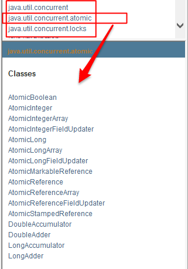
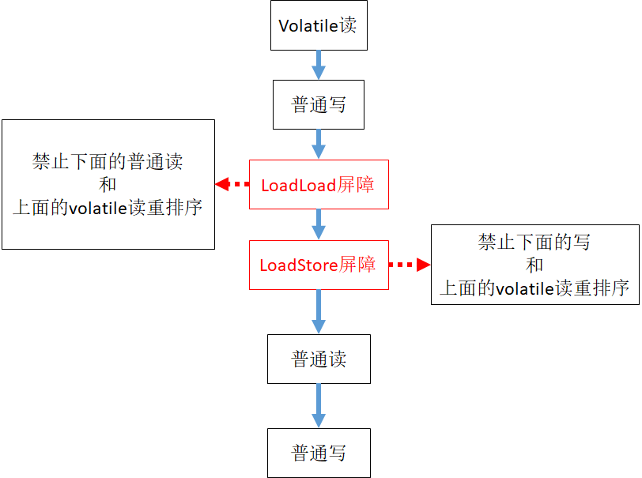

##1.volatile的理解
### [1].volatile是java虚拟机提供的轻量级的同步机制
####①.保证可见性（当有线程改变了主内存中的数据，其他线程马上能收到变动）
#####[volatile保证可见性](./code/VolatileTest1.java)
####②.不保证原子性
#####[volatile不保证原子性](./code/VolatileTest2.java)
####③.禁止指令重排（保证有序性）,关于[有序性](#ordering)
##2.JMM
###[1].介绍
####①.java内存模型(即Java Memory Model，简称JMM)本身是一种抽象的概念，并不真实存在，它描述的是一组规则或规范，通过这组规范定义了程序中各个变量（包括实例字段，静态字段和构成数组对象的元素）的访问方式。
####②.JMM关于同步的规定：
线程解锁前，必须把共享变量的值刷新回主内存
线程加锁前，必须读取主内存的最新值到自己的工作内存
加锁解锁是同一把锁
####③.由于JVM运行程序的实体是线程，而每个线程创建时JVM都会为其创建一个工作内存(有些地方称为栈空间)，用于存储线程私有的数据，而Java内存模型中规定所有变量都存储在主内存，主内存是共享内存区域，所有线程都可以访问，但线程对变量的操作(读取赋值等)必须在工作内存中进行，首先要将变量从主内存拷贝的自己的工作内存空间，然后对变量进行操作，操作完成后再将变量写回主内存，不能直接操作主内存中的变量，工作内存中存储着主内存中的变量副本拷贝，前面说过，工作内存是每个线程的私有数据区域，因此不同的线程间无法访问对方的工作内存，线程间的通信(传值)必须通过主内存来完成，其简要访问过程如下图

###[2].可见性
各个线程对主内存中共享变量的操作都是各个线程各自拷贝到自己的工作的工作内存进行读写操作后在写到主内存中的，这就可能存在一个线程AAA修改了共享变量num的值但还未写回主内存时，另外一个线程BBB又对主内存中同一个变量num进行操作，但此时A线程工作内存中共享变量num对线程B来说并不可见，这种工作内存与主存同步延迟的现象就造成了可见性问题
###[3].原子性
####①.为什么num++在多线程下是非线程安全的

虽然++操作从源码上看是一条命令，但实际从字节码来看是4步，所以加了volatile仍然无法保证原子性
####②.解决方式1：synchronized解决（性能低）
####③.解决方式2：采用原子类：原子类是juc（java.util.concurrent）下面的保证原子性的包装类

#####[原子类的使用](./code/VolatileTest3.java)
###[4].<span id='ordering'>有序性</span>
####①.计算机在执行程序时，为了提高性能，编译器和处理器的常常会对指令做重排，一般分以下3种：

####a.编译器优化的重排序：
编译器在不改变单线程程序语义的前提下，可以重新安排语句的执行顺序。【as-if-serial原则保证，as-if-serial语义：不管怎么重排序（编译器和处理器为了提高并行度），（单线程）程序的执行结果不能被改变。】
####b.指令级并行的重排序：
现代处理器采用了指令级并行技术来将多条指令重叠执行。如果不存在数据依赖性(即后一个执行的语句无需依赖前面执行的语句的结果)，处理器可以改变语句对应的机器指令的执行顺序。
```
int x = 1;//步骤1
int y = 2;//步骤2
x = x + 1;//步骤3
y = x + x;//步骤4
重排后可能的顺序：
1234
1324
2134
4***肯定是不行的，必须准守数据依赖
```
####c.内存系统重排序：
由于处理器使用缓存和读写缓存冲区，这使得加载(load)和存储(store)操作看上去可能是在乱序执行，因为三级缓存的存在，导致内存与缓存的数据同步存在时间差。两个线程中使用的变量能否保证一致性无法确定。
int x,y,a,b=0；

| 线程1 | 线程2 |
| ---- | ---- |
| x=a; | y=b; |
| x = a; | y = b; |
| x = 2  y = 1 ||
指令重排后

| 线程1 | 线程2 |
| ---- | ---- |
| b = 1; | a = 2; |
| x = a; | y = b; |
| x = 2  y = 1 ||

#### ②.volatile禁止指令重排原理
##### a.volatile关键字另一个作用就是禁止指令重排优化，从而避免多线程环境下程序出现乱序执行的现象，关于指令重排优化前面已详细分析过，这里主要简单说明一下volatile是如何实现禁止指令重排优化的。
##### b.先了解一个概念，内存屏障(Memory Barrier）。内存屏障，又称内存栅栏，是一个CPU指令，它的作用有两个
###### i.一是保证特定操作的执行顺序，
###### ii.二是保证某些变量的内存可见性（利用该特性实现volatile的内存可见性）。
##### c.硬件层的内存屏障分为两种：Load Barrier 和 Store Barrier即读屏障和写屏障
##### d.java内存屏障主要4种
###### i.LoadLoad屏障：对于这样的语句Load1; LoadLoad; Load2，在Load2及后续读取操作要读取的数据被访问前，保证Load1要读取的数据被读取完毕。
###### ii.StoreStore屏障：对于这样的语句Store1; StoreStore; Store2，在Store2及后续写入操作执行前，保证Store1的写入操作对其它处理器可见。
###### iii.LoadStore屏障：对于这样的语句Load1; LoadStore; Store2，在Store2及后续写入操作被刷出前，保证Load1要读取的数据被读取完毕。
###### iv.StoreLoad屏障：对于这样的语句Store1; StoreLoad; Load2，在Load2及后续所有读取操作执行前，保证Store1的写入对所有处理器可见。它的开销是四种屏障中最大的。在大多数处理器的实现中，这个屏障是个万能屏障，兼具其它三种内存屏障的功能
##### e.由于编译器和处理器都能执行指令重排优化。如果在指令间插入一条Memory Barrier则会告诉编译器和CPU，不管什么指令都不能和这条Memory Barrier指令重排序，也就是说通过插入内存屏障禁止在内存屏障前后的指令执行重排序优化。Memory Barrier的另外一个作用是强制刷出各种CPU的缓存数据，因此任何CPU上的线程都能读取到这些数据的最新版本。总之，volatile变量正是通过内存屏障实现其在内存中的语义，即可见性和禁止重排优化。

| 对Volatile变量进行读操作时，会在读操作前加入一条load屏障指令，从主内存中读取共享变量 | 对Volatile变量进行写操作时，会在写操作后加入一条store屏障指令，将工作内存中的共享变量值刷新回到主内存 |
| ---- | ---- |
|  |  |

#### ③.指令重排经典案例之DCL，这里不讨论synchronized
##### a.[代码](./code/DoubleCheckLock.java)
##### b.上述代码一个经典的单例的双重检测的代码，这段代码在单线程环境下并没有什么问题，但如果在多线程环境下就可以出现线程安全问题。原因在于某一个线程执行到第一次检测，读取到的instance不为null时，instance的引用对象可能没有完成初始化。因为instance = new DoubleCheckLock();可以分为以下3步完成(伪代码)
```
memory = allocate(); //1.分配对象内存空间
instance = memory;   //3.设置instance指向刚分配的内存地址，此时instance！=null，但是对象还没有初始化完成！
instance(memory);    //2.初始化对象
```
##### c.由于步骤2和步骤3不存在数据依赖关系，而且无论重排前还是重排后程序的执行结果在单线程中并没有改变，因此这种重排优化是允许的。但是指令重排只会保证串行语义的执行的一致性(单线程)，但并不会关心多线程间的语义一致性。所以当一条线程访问instance不为null时，由于instance实例未必已初始化完成，也就造成了线程安全问题。那么该如何解决呢，很简单，我们使用volatile禁止instance变量被执行指令重排优化即可。
```java
//禁止指令重排优化
private volatile static DoubleCheckLock instance;
```
### [5].先行发生：倘若在程序开发中，仅靠synchronized和volatile关键字来保证原子性、可见性以及有序性，那么编写并发程序可能会显得十分麻烦，幸运的是，在Java内存模型中，还提供了happens-before 原则来辅助保证程序执行的原子性、可见性以及有序性的问题，它是判断数据是否存在竞争、线程是否安全的依据，happens-before 原则内容如下
##### ①.程序顺序原则，即在一个线程内必须保证语义串行性，也就是说按照代码顺序执行。
##### ②.锁规则 解锁(unlock)操作必然发生在后续的同一个锁的加锁(lock)之前，也就是说，如果对于一个锁解锁后，再加锁，那么加锁的动作必须在解锁动作之后(同一个锁)。
##### ③.volatile规则 volatile变量的写，先发生于读，这保证了volatile变量的可见性，简单的理解就是，volatile变量在每次被线程访问时，都强迫从主内存中读该变量的值，而当该变量发生变化时，又会强迫将最新的值刷新到主内存，任何时刻，不同的线程总是能够看到该变量的最新值。
##### ④.线程启动规则 线程的start()方法先于它的每一个动作，即如果线程A在执行线程B的start方法之前修改了共享变量的值，那么当线程B执行start方法时，线程A对共享变量的修改对线程B可见
##### ⑤.传递性 A先于B ，B先于C 那么A必然先于C
##### ⑥.线程终止规则 线程的所有操作先于线程的终结，Thread.join()方法的作用是等待当前执行的线程终止。假设在线程B终止之前，修改了共享变量，线程A从线程B的join方法成功返回后，线程B对共享变量的修改将对线程A可见。
##### ⑦.线程中断规则 对线程 interrupt()方法的调用先行发生于被中断线程的代码检测到中断事件的发生，可以通过Thread.interrupted()方法检测线程是否中断。
##### ⑧.对象终结规则 对象的构造函数执行，结束先于finalize()方法
### [6].先行发生案例
#### ①.上述8条原则无需手动添加任何同步手段(synchronized|volatile)即可达到效果，下面我们结合前面的案例演示这8条原则如何判断线程是否安全，如下：
##### [代码](./code/MixedOrder.java)
#### ②.分析
存在两条线程A和B，线程A调用实例对象的writer()方法，而线程B调用实例对象的read()方法，线程A先启动而线程B后启动，那么线程B读取到的i值是多少呢？现在依据8条原则，由于存在两条线程同时调用，因此程序次序原则不合适。writer()方法和read()方法都没有使用同步手段，锁规则也不合适。没有使用volatile关键字，volatile变量原则不适应。线程启动规则、线程终止规则、线程中断规则、对象终结规则、传递性和本次测试案例也不合适。线程A和线程B的启动时间虽然有先后，但线程B执行结果却是不确定，也是说上述代码没有适合8条原则中的任意一条，也没有使用任何同步手段，所以上述的操作是线程不安全的，因此线程B读取的值自然也是不确定的。修复这个问题的方式很简单，要么给writer()方法和read()方法添加同步手段，如synchronized或者给变量flag添加volatile关键字，确保线程A修改的值对线程B总是可见。