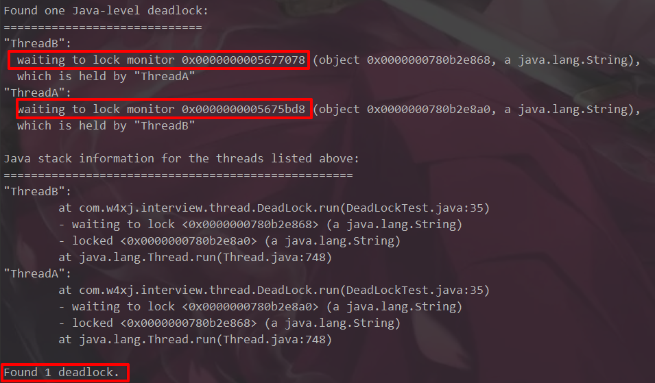

## 1.死锁
### [1].是什么？
    互相持有资源等待对方释放资源，如哲学家用餐
### [2].原因
    资源不足
    推进顺序不合适
    资源分配不当
## 2.写一个死锁
### [1].代码
##### [死锁代码](./code/DeadLockTest.java)
### [2].现象

## 3.排查死锁
### [1].jps
#### ①.即java ps
#### ②.IDEA有集成的dos界面，可直接使用

### [2].jstack
#### ①.打印栈信息
#### ②.使用 jstack 进程id

#### ③.找到死锁信息
