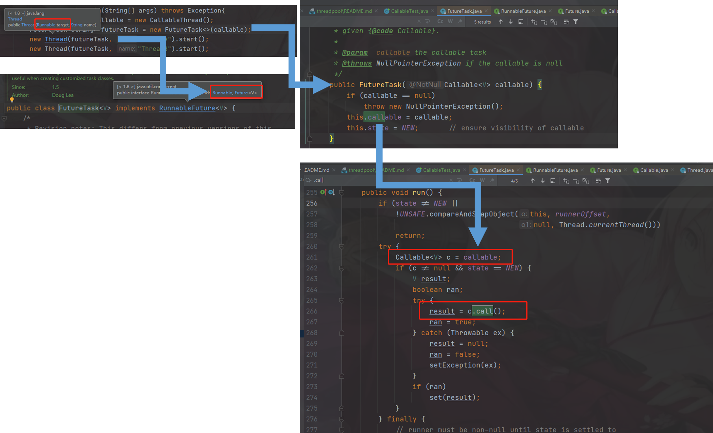
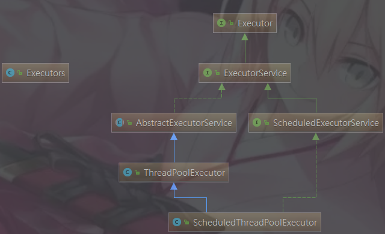
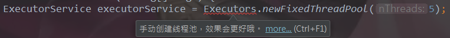
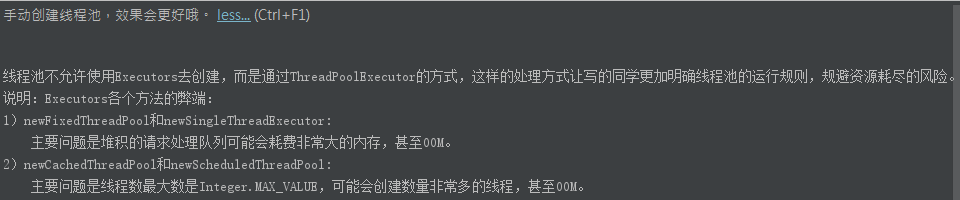

##  1.获得线程的方法
### [1].extends Thread（不推荐用）

```java
class ThreadThread extends Thread {
    @Override
    public synchronized void start() {
        
    }
}
```
### [2].implements Runnable
```java
/**
* 实现Runnable
*/
class RunnableThread implements Runnable{
    @Override
    public void run() {
        
    }
}
```
### [3].Callable
#### ①.代码
```java
/**
* 实现Callable接口
*/
class CallableThread implements Callable<Integer>{

    @Override
    public Integer call() throws Exception {
        return null;
    }
}
```
#### ②.和Runnable对比
    有返回值
    抛异常
    重写的方法不同
#### ③.使用
##### [Callable创建线程](./code/CallableTest.java)
#### ④.注意
##### a.Thread构造传入Runnable接口，Runnable接口有一个实现子类FutureTask，FutureTask有个一构造器传入的是Callable接口（适配者模式）

#### b.两个Thread使用同一个FutureTask实例，只会调用一次call方法
#### c.Future.get()获得call的返回值，但是这个方法应该尽量放在后面，因为会阻塞当前调用这个方法的线程，同时可以结合Future.isDone()方法自旋锁来使用
### <span style="color:red">[4].线程池，企业里肯定用的是线程池</span>
## 2.线程池
### [1].线程池用于多线程处理中，它可以根据系统的情况，可以有效控制线程执行的数量，优化运行效果。线程池做的工作主要是控制运行的线程的数量，处理过程中将任务放入<span style="color:red">队列</span>，然后在线程创建后启动这些任务，如果线程数量超过了最大数量，超出数量的线程排队等候，等其它线程执行完毕，再从队列中取出任务来执行。
### [2].线程池的3个优点：
    线程复用，不需要频繁的创建和销毁线程
    控制最大并发数，提高系统资源利用率，同时避免过多的资源竞争，避免堵塞
    管理线程
### [3].目的：减少大量创建和销毁线程带来的时间和空间上的消耗。
### [4].架构

## 3.方法
### [1].了解
#### ①.Executors.newScheduledThreadPool();
#### ②.java8-Executor.newWorkStealingPool(int)：使用目前机器上可用的处理器作为它的并行级别
### [2].常用（但是实际也不用）
#### ①.Executors.newFixedThreadPool(int)：适合长期任务
##### a.源码
```java
public static ExecutorService newFixedThreadPool(int nThreads) {
    return new ThreadPoolExecutor(nThreads, nThreads,
                                  0L, TimeUnit.MILLISECONDS,
                                  new LinkedBlockingQueue<Runnable>());
}
```
##### b.创建一个定长线程池，可控制线程最大并发数，超出的线程会在队列中等待
##### c.newFixedThreadPool创建的线程池corePoolSize和maximumPoolSize值是相等的，他使用的LinkedBlockingQueue
#### ②.Executors.newSingleThreadExecutor()：一个任务一个任务执行的场景
##### a.源码
```java
public static ExecutorService newSingleThreadExecutor() {
    return new FinalizableDelegatedExecutorService
        (new ThreadPoolExecutor(1, 1,
                                0L, TimeUnit.MILLISECONDS,
                                new LinkedBlockingQueue<Runnable>()));
}
```
##### b.创建一个单线程化的线程池，他只会用唯一的工作线程来执行任务，保证所有任务按照指定顺序执行
##### c.newSingleThreadExecutor将corePoolSize和maximumPoolSize都设置为1，它使用的LinkedBlockingQueue
#### ③.Executors.newCahedThreadPool()：执行很多短期异步的小程序或者负载较轻的服务器
##### a.创建一个可缓存线程池，如果线程池超过处理需要，可灵活回收空闲线程，若无可回收，则新建线程
##### b.newCachedThreadPool将corePoolSize设置为0，将maximumPoolSize设置为Integer.MAX_VALUE，使用的SynchronizedQueue，也就是说来了任务就创建线程运行，当线程空闲超过60秒，就销毁线程
### [3].Executors使用方式
[Executors使用示例代码](./code/ExecutorsTest.java)
## 4.ThreadPoolExecutor参数（5+2=7）
### [0].ThreadPoolExecutor？
#### ①.根据之前的架构图我们发现ThreadPoolExecutor这个类是实现Executor的子类
#### ②.源码
```java
public ThreadPoolExecutor(int corePoolSize,
                          int maximumPoolSize,
                          long keepAliveTime,
                          TimeUnit unit,
                          BlockingQueue<Runnable> workQueue,
                          ThreadFactory threadFactory,
                          RejectedExecutionHandler handler) {
    if (corePoolSize < 0 ||
        maximumPoolSize <= 0 ||
        maximumPoolSize < corePoolSize ||
        keepAliveTime < 0)
        throw new IllegalArgumentException();
    if (workQueue == null || threadFactory == null || handler == null)
        throw new NullPointerException();
    this.acc = System.getSecurityManager() == null ?
            null :
            AccessController.getContext();
    this.corePoolSize = corePoolSize;
    this.maximumPoolSize = maximumPoolSize;
    this.workQueue = workQueue;
    this.keepAliveTime = unit.toNanos(keepAliveTime);
    this.threadFactory = threadFactory;
    this.handler = handler;
}
```
#### <span style="color:red">③.你在工作中Executors单一的/ 固定的/ 可变的三种创建线程池的方法，你用哪个最多？超级大坑！</span>
###### <span style="color:red">答：一个都不用，我们生产上只能使用自定义的，或者用开源类库</span>
###### <span style="color:red">为什么？</span>


### [1].corePoolSize：线程池中的常驻核心线程数；
#### ①.在创建了线程池后，当有请求任务来之后，就会安排池中的线程去执行请求任务，近似理解为今日当值线程；
#### ②.当线程池中的线程数目达到corePoolSize后，就会把到达的任务放到缓存队列中；
### [2].maximumPoolSize：线程池能够容纳同时执行的最大线程树，此值必须大于等于1；
### [3].keepAliveTime：多余的空闲线程的存活时间。
当前线程池数量超过corePoolSize时，当空闲时间达到keepAliveTime值时，多余空闲线程会被销毁直到只剩下corePoolSize个线程为止。
默认情况下： 只有当线程池中的线程数大于corePoolSize时KeepAliveTime才会起作用，直到线程池中的线程数不大于corePoolSize
### [4].unit：KeepAliveTime的单位
### [5].workQueue：任务队列，被提交但尚未被执行的任务；
### [6].threadFactory：表示生成线程池中工作线程的线程的工厂，用于创建线程一般用默认的即可；
### [7].handler：拒绝策略，表示当队列满了并且工作线程大于等于线程池的最大线程数（maximumPool )
## 5.运行流程

### [1].在创建了线程池后，等待提交过来的任务请求。
### [2].当调用execute()方法添加一个请求时，线程池会做如下判断
#### ①.如果正在运行的线程数量小于corePoolSize，那么马上创建线程运行这个任务
#### ②.如果正在运行的线程数量大于或等于corePoolSize，那么将这个任务放入队列
#### ③.如果这时候队列满了，且正在运行的线程数量还小于maximumPoolSize，那么还是要创建非核心线程运行这个任务
#### ④.如果队列满了且正在运行的线程数量大于或等于maximumPoolSize，那么线程池会启动饱和<span style="color:red">拒绝策略</span>来执行
### [3].当一个线程完成任务时，他会从队列中取下一个任务来执行
### [4].当一个线程无事可做超过一定的时间（keepAliveTime）时，线程池会判断：如果当前的线程数大于corePoolSize，那么这个线程就会被停掉，所以线程池的所有任务完成后他最终会<span style="color:red">收缩到corePoolSize的大小</span>
6.线程池的拒绝策略
### [1].等待队列也已经满了，再也塞不下新任务了，同时，线程池中的max线程也达到了，无法继续为新任务服务。这时候我们就需要拒绝策略机制合理的处理这个问题。
### [2].AbortPolicy（默认）：直接抛出RejectedExecutionException异常阻止系统正常运行；
### [3].CallerRunsPolicy：“调用者运行”一种调节机制，该策略既不会抛弃任务，也不会抛出异常，而是将某些任务会退到调用者，从而降低新任务的流量；
### [4].DiscardOldestPolicy：抛弃队列中等待最久的任务，然后把当前任务加入队列中尝试再次提交当前任务。
### [5].DiscardPolicy：直接丢弃任务，不予任何处理也不抛异常。如果允许任务丢失，这是最好的一种方案。
### [6].以上内置拒绝策略均实现了RejectedExecutionHandler接口；
## 7.在4.[0].③中提到手写线程池，因为默认的三种都不符合实际业务需求
### [1].代码
[手写线程池代码](./code/ThreadPoolTest.java)
### [2].线程数如何配置？
#### ①.CPU密集
##### 该任务需要大量的运算，而没有阻塞，CPU一直全速运行；CPU密集任务只有在真正的多核CPU上才可能得到加速（通过多线程），而在单核CPU上，无论你开几个模拟的多线程该任务都不可能得到加速，因为CPU总的运算能力就那些。
##### CPU密集型任务配置尽可能少的线程数量：一般公式：CPU核数+1个线程的线程池；
#### ②.IO密集型：即该任务需要大量的IO，即大量的阻塞；
##### 由于IO密集型任务线程并不是一直在执行任务，则应配置尽可能多的线程，如CPU核数*2（*3）；
##### 在单线程上运行IO密集型的任务会导致浪费大量的CPU运算能力-浪费在等待。
##### 所以IO密集型任务中使用多线程可以大大的加速程序运行，即使在单核CPU上，这种加速主要就是利用了被浪费掉的阻塞时间。
##### IO密集型时，大部分线程都阻塞，故需要多配置线程数：
##### 参考公式：CPU核数 / 1-阻塞系数　　阻塞系数在0.8--0.9之间。　　比如8核CPU：8 / 1-0.9 = 80个线程数
## 8.使用开源类库
##### Hollis 大佬之前在他的文章中也提到了：“除了自己定义ThreadPoolExecutor外。还有其他方法。这个时候第一时间就应该想到开源类库，如apache和guava等。”他推荐使用guava提供的ThreadFactoryBuilder来创建线程池
[guava线程池使用案例](./code/GuavaExecutorsTest.java)
引如jar
```xml
<dependency>
    <groupId>com.google.guava</groupId>
    <artifactId>guava</artifactId>
    <version>16.0.1</version>
</dependency>
```