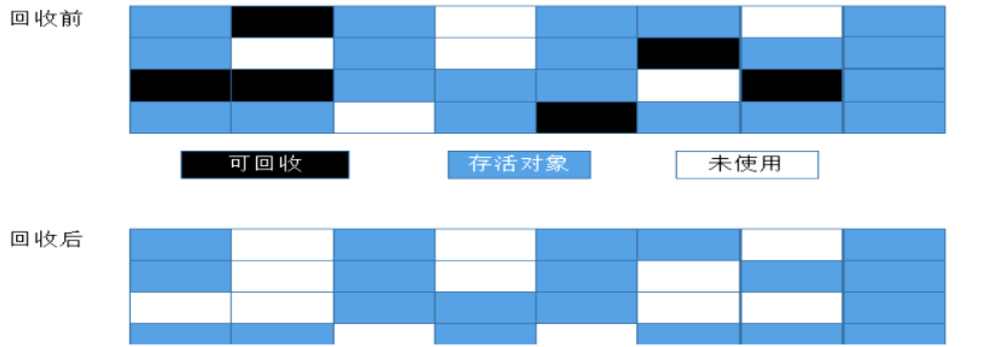
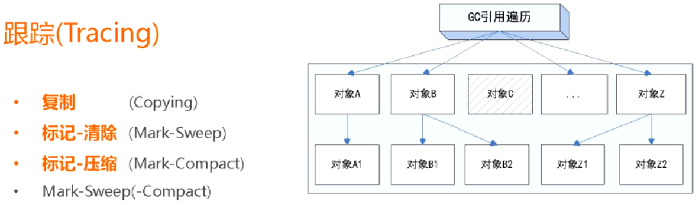
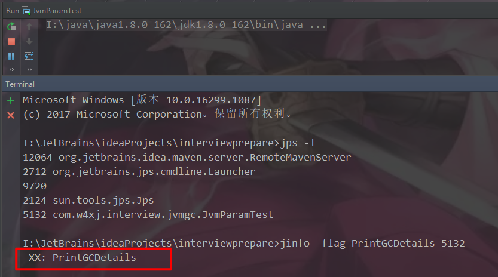
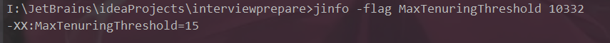
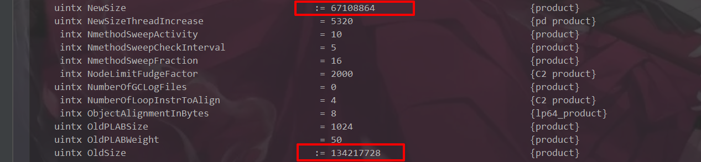
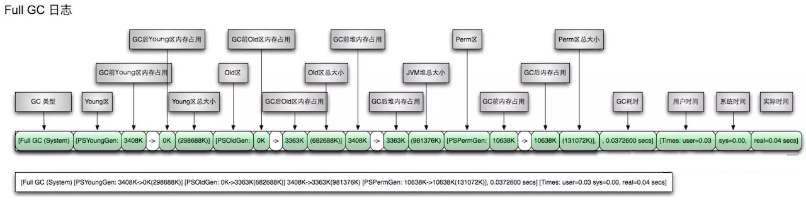

## 1.简单梳理
### [1].JVM体系概述

### [2].jdk1.7与jdk1.8：永久代改为元空间
### [3].GC作用域：方法区和堆（线程共享）
### [4].Java中常用的垃圾收集算法：
#### ①.引用计数：很少用
#### ②.复制算法：复制-清空-交换
###### 将可用内存按容量分成大小相等的两块，每次只使用其中一块，当这块内存使用完了，就将还存活的对象复制到另一块内存上去，然后把使用过的内存空间一次清理掉。这样使得每次都是对其中一块内存进行回收，内存分配时不用考虑内存碎片等复杂情况，只需要移动堆顶指针，按顺序分配内存即可，实现简单，运行高效。
###### 复制算法的缺点显而易见，可使用的内存降为原来一半。
#### ③.标记-清除算法：
###### 最基础的垃圾收集算法，算法分为“标记”和“清除”两个阶段：首先标记出所有需要回收的对象，在标记完成之后统一回收掉所有被标记的对象。标记-清除算法的缺点有两个：首先，效率问题，标记和清除效率都不高。其次，标记清除之后会产生大量的不连续的内存碎片，空间碎片太多会导致当程序需要为较大对象分配内存时无法找到足够的连续内存而不得不提前触发另一次垃圾收集动作。

#### ④.标记-整理算法：
###### 标记-整理算法在标记-清除算法基础上做了改进，标记阶段是相同的标记出所有需要回收的对象，在标记完成之后不是直接对可回收对象进行清理，而是让所有存活的对象都向一端移动，在移动过程中清理掉可回收的对象，这个过程叫做整理。
###### 标记-整理算法相比标记-清除算法的优点是内存被整理以后不会产生大量不连续内存碎片问题。
###### 复制算法在对象存活率高的情况下就要执行较多的复制操作，效率将会变低，而在对象存活率高的情况下使用标记-整理算法效率会大大提高。
#### ⑤.分代收集（将上述算法应用在不同的内存区域，复制主要用于新生代，标清标整主要用于老年代）：
###### 根据内存中对象的存活周期不同，将内存划分为几块，java的虚拟机中一般把内存划分为新生代和年老代，当新创建对象时一般在新生代中分配内存空间，当新生代垃圾收集器回收几次之后仍然存活的对象会被移动到年老代内存中，当大对象在新生代中无法找到足够的连续内存时也直接在年老代中创建。
## 2.JVM垃圾回收的时候如何确定是垃圾，什么是GC Root？
### [1].什么是垃圾？
###### 就是内存中已经不再使用到的空间就是垃圾
### [2].如何判断一个对象是否可以被回收？
#### ①.引用计数法
##### Java中，引用和对象是关联的，如果要操作对象则必须用引用进行，引用对象就是给对象添加一个引用计数器，每当有一个地方引用则+1，引用失效则-1，如果没有地方被使用，则被回收。其无法解决循环引用的问题，所以现在已经基本不用了
#### ②.根搜索路径算法（GCRoot）：枚举根节点做可达性分析
##### 为了解决循环引用问题，java使用了可达性分析的方法


##### 所谓GCRoot/TracingGC的根节点就是一组必须活跃的引用，基本思路就是通过一系列名为GC Roots的对象作为起始点，从这个被称为GCRoots的对象开始想下搜索，如果一个对象到GCRoots没有任何引用连接时，则说明此对象不可用，也即给定一个集合的应用作为根出发，通过引用关系遍历对象图，能被遍历到的（可到达的）对象就被判定为存活；没有被遍历到的就自然被判定为死亡，上图的对象C则将会被回收
### [3].哪些对象可以作为GCRoots？
#### ①.虚拟机栈（栈帧中的局部变量区，也叫做局部变量表）引用的对象
#### ②.方法中的静态属性引用对象
#### ③.方法中常量引用的对象
#### ④.本地方法栈中JNI（Native）引用的对象
## 3.如何查看JVM系统参数，JVM调优？
### [0].命令
#### ①.jinfo -flag 参数项 pid：查询指定参数项
#### ②.jinfo -flags pid：查询所有的jvm参数
### [1].参数类型
#### ①.标配参数：标准参数（-），所有的JVM实现都必须实现这些参数的功能，而且向后兼容；
    -version
    -help
    -showversion
#### ②.X参数：非标准参数（-X），默认jvm实现这些参数的功能，但是并不保证所有jvm实现都满足，且不保证向后兼容；
    -Xint：解释执行
    -Xcomp：第一次使用就编译成本地源码
    -Xmixed：混合模式
#### ③.XX参数：非Stable参数（-XX），此类参数各个jvm实现会有所不同，将来可能会随时取消，需要慎重使用；
    boolean类型
    KV设值类型
### [2].boolean类型
#### ①.公式：-XX:+或者-某个属性值
    +表示开启
    -表示关闭
#### ②.案例：查看是否打印GC收集信息
##### a.写一段代码，让其处于运行状态，这里为了测试，直接让线程睡眠并将其运行

##### b.在terminal中运行jps，查出进程id，在运行jinfo -flag PrintGCDetails pid

##### c.修改运行时参数，设置PrintGCDetails为开启

##### d.再次运行

### [3].设置值类型
#### ①.语法：-XX:属性key=属性value
#### ②.案例：查看metaspace默认值
##### a.jinfo -flag MetaspaceSize pid

##### b.调整运行时参数MetaspaceSize大小

##### c.再次运行，这个值虽然和设置的有一点偏差，应该是是由于换算单位或者其他原因引起的

#### ③.案例：查看年龄阈值

### [4].参数大全
#### ①查看
##### a.非标准参数（-X）可以通过java -X查看
##### b.-XX参数
    java -XX:+PrintFlagsInitial（查看初始默认值）
    java -XX:+PrintFlagsFinal (查看修改后的值，JVM修改或者认为修改，:代表修改过的值)

##### c.运行java的同时打出参数
```xml
public class J{
    public static void main(String[] args){
        System.out.println("aaaa");
    }
}
```
    运行java -XX:+PrintFlagsFinal -Xss128k J


    还比如java -XX:+PrintFlagsFinal -XX:MetaspaceSize=512M J
##### d.java -XX:+PrintCommandLineFlags -version

#### ②.关于jdk8
##### 在java8中，永久代已经被移除，被一个称为元空间的区域所取代，元空间的本质和永久代类似。
##### 元空间和永久代的区别在于：永久代使用的是JVM的堆内存，但是java8以后的元空间并不在虚拟机中，而是使用本机物理内存。因此在默认情况下，元空间的大小仅受到本地内存限制，类的原数据放入native memory，字符串池和类的静态变量放入java堆中，这样可以加载更多类的原数据就不再由MaxPermSize控制，而由系统的实际可用空间来控制，新生代和老年代比例默认1:2，伊甸园区和幸存者1区、幸存者1区比例默认为8:1:1，也即Eden:S0:S1:Old Memory = 8:1:1:20

#### ③.可通过程序查看当前参数
[通过程序查看当前参数](./code/GetJvmParam.java)
#### ④.常用参数
| 参数名称 | 含义 | 默认值 | 备注 |
| ----- | ----- | ----- | ----- |
| <span style="background-color:#737300">内存相关</span> | | | |
| -Xms | 等价于-XX:InitialHeapSize初始堆大小 | 物理内存的1/64(<1GB) | 默认(MinHeapFreeRatio参数可以调整)空余堆内存小于40%时，JVM就会增大堆直到-Xmx的最大限制.<br/><span style="color:red">建议和Xmx配成一样</span> |
| -Xmx | 等价于-XX:MaxHeapSize最大堆大小 | 物理内存的1/4(<1GB) | 默认(MaxHeapFreeRatio参数可以调整)空余堆内存大于70%时，JVM会减少堆直到 -Xms的最小限制。<br/>建议和Xms配成一样 |
| -Xmn | 年轻代大小 | 新生代和老年代比例默认1:2，伊甸园区和幸存者1区、幸存者1区比例默认为8:1:1，也即Eden:S0:S1:Old Memory = 8:1:1:20 | 注意：此处的大小是（eden+ 2 survivor space).与jmap -heap中显示的New gen是不同的。 |
| -XX:NewSize | 设置年轻代大小(for 1.3/1.4) |||
| -XX:MaxNewSize | 年轻代最大值(for 1.3/1.4) |||
| -XX:PermSize | 设置持久代(perm gen)初始值 | 物理内存的1/64 ||
| -XX:MaxPermSize | 设置持久代最大值 | 物理内存的1/4 ||
| -Xss | 每个线程的堆栈大小<br/>等价于-XX:ThreadStackSize | 512k~1024k<br/>官网原话：The default value depends on virtual memory. | JDK5.0以后每个线程堆栈大小为1M,以前每个线程堆栈大小为256K.更具应用的线程所需内存大小进行 调整.在相同物理内存下,减小这个值能生成更多的线程.但是操作系统对一个进程内的线程数还是有限制的,不能无限生成,经验值在3000~5000左右<br/>一般小的应用， 如果栈不是很深， 应该是128k够用的 大的应用建议使用256k。这个选项对性能影响比较大，需要严格的测试。<br/>和threadstacksize选项解释很类似，This option is equivalent to -XX:ThreadStackSize. |
| -XX:MetaspaceSize | 设置元空间的大小 | 默认大约20M左右 | 元空间的本质和永久代类似，都是对JVM规范中方法区的实现，不过元空间和永久代最大的区别在于：元空间并不在虚拟机中，而是使用本地内存。因此，默认情况下，元空间的大小仅受本地内存限制<br/>推荐设置-XX:MetaspaceSize=1024m |
| -XX:ThreadStackSize | Thread Stack Size |  | (0 means use default stack size) \[Sparc: 512; Solaris x86: 320 (was 256 prior in 5.0 and earlier); Sparc 64 bit: 1024; Linux amd64: 1024 (was 0 in 5.0 and earlier); all others 0.] |
| -XX:NewRatio | 年轻代(包括Eden和两个Survivor区)与年老代的比值(除去持久代) | 2 | -XX:NewRatio=4表示年轻代与年老代所占比值为1:4,年轻代占整个堆栈的1/5。<br/>Xms=Xmx并且设置了Xmn的情况下，该参数不需要进行设置。|
| -XX:SurvivorRatio | Eden区与Survivor区的大小比值 | 8 | 设置为8,则两个Survivor区与一个Eden区的比值为2:8,一个Survivor区占整个年轻代的1/10 |
| -XX:LargePageSizeInBytes | 内存页的大小不可设置过大， 会影响Perm的大小 |  | =128m |
| -XX:+UseFastAccessorMethods | 原始类型的快速优化 | | |
| -XX:+DisableExplicitGC | 关闭System.gc() |  | 这个参数需要严格的测试 |
| -XX:MaxTenuringThreshold | 垃圾最大年龄 |  |如果设置为0的话,则年轻代对象不经过Survivor区,直接进入年老代. 对于年老代比较多的应用,可以提高效率.如果将此值设置为一个较大值,则年轻代对象会在Survivor区进行多次复制,这样可以增加对象再年轻代的存活 时间,增加在年轻代即被回收的概率<br/>该参数只有在串行GC时才有效.|
| -XX:+AggressiveOpts | 加快编译 | | |
| -XX:+UseBiasedLocking | 锁机制的性能改善 | | |
| -Xnoclassgc | 禁用垃圾回收 | | |
| -XX:SoftRefLRUPolicyMSPerMB | 每兆堆空闲空间中SoftReference的存活时间 | 1s | softly reachable objects will remain alive for some amount of time after the last time they were referenced. The default value is one second of lifetime per free megabyte in the heap |
| -XX:PretenureSizeThreshold | 对象超过多大是直接在旧生代分配 | 0 |单位字节 新生代采用Parallel Scavenge GC时无效。<br/>另一种直接在旧生代分配的情况是大的数组对象,且数组中无外部引用对象。|
| -XX:TLABWasteTargetPercent | TLAB占eden区的百分比 | 1% | | 
| -XX:+CollectGen0First | FullGC时是否先YGC | FALSE | |
| -XX:+CollectGen0First | FullGC时是否先YGC | FALSE | |
| <span style="background-color:#5A5AAD">并行收集器相关参数</span> | | | |
| -XX:+UseParallelGC | Full GC采用parallel MSC |  | 选择垃圾收集器为并行收集器.此配置仅对年轻代有效.即上述配置下,年轻代使用并发收集,而年老代仍旧使用串行收集.(此项待验证) |
| -XX:+UseParNewGC | 设置年轻代为并行收集 | | 可与CMS收集同时使用。<br/>JDK5.0以上,JVM会根据系统配置自行设置,所以无需再设置此值|
| -XX:ParallelGCThreads | 并行收集器的线程数 | | 此值最好配置与处理器数目相等 同样适用于CMS |
| -XX:+UseParallelOldGC | 年老代垃圾收集方式为并行收集(Parallel Compacting) | | 这个是JAVA 6出现的参数选项 |
| -XX:MaxGCPauseMillis | 每次年轻代垃圾回收的最长时间(最大暂停时间) | | 如果无法满足此时间,JVM会自动调整年轻代大小,以满足此值。 |
| -XX:+UseAdaptiveSizePolicy | 自动选择年轻代区大小和相应的Survivor区比例 | | 设置此选项后,并行收集器会自动选择年轻代区大小和相应的Survivor区比例,以达到目标系统规定的最低相应时间或者收集频率等,此值建议使用并行收集器时,一直打开. |
| -XX:GCTimeRatio | 设置垃圾回收时间占程序运行时间的百分比 | | 公式为1/(1+n) |
| -XX:+ScavengeBeforeFullGC | Full GC前调用YGC | TRUE | Do young generation GC prior to a full GC. (Introduced in 1.4.1.) |
| <span style=" background-color:#F75000">CMS相关参数</span> | | | |
| XX:+UseConcMarkSweepGC | 使用CMS内存收集 | | 测试中配置这个以后,-XX:NewRatio=4的配置失效了,原因不明.所以,此时年轻代大小最好用-Xmn设置.??? |
| -XX:+AggressiveHeap | | |试图是使用大量的物理内存。<br/>长时间大内存使用的优化，能检查计算资源（内存， 处理器数量） 。<br/>至少需要256MB内存。<br/>大量的CPU／内存，（在1.4.1在4CPU的机器上已经显示有提升）|
| -XX:CMSFullGCsBeforeCompaction | 多少次后进行内存压缩 | | 由于并发收集器不对内存空间进行压缩,整理,所以运行一段时间以后会产生"碎片",使得运行效率降低.此值设置运行多少次GC以后对内存空间进行压缩,整理. |
| -XX:+CMSParallelRemarkEnabled | 降低标记停顿 | | |
| -XX+UseCMSCompactAtFullCollection | 在FULL GC的时候，对年老代的压缩 | | CMS是不会移动内存的， 因此， 这个非常容易产生碎片， 导致内存不够用， 因此， 内存的压缩这个时候就会被启用。 增加这个参数是个好习惯。<br/>可能会影响性能,但是可以消除碎片 |
| -XX:+UseCMSInitiatingOccupancyOnly | 使用手动定义初始化定义开始CMS收集 | | 禁止hostspot自行触发CMS GC |
| -XX:CMSInitiatingOccupancyFraction=70 | 使用cms作为垃圾回收<br/>使用70％后开始CMS收集 | 92 | 为了保证不出现promotion failed(见下面介绍)错误,该值的设置需要满足以下公式CMSInitiatingOccupancyFraction计算公式 |
| -XX:CMSInitiatingPermOccupancyFraction | 设置Perm Gen使用到达多少比率时触发 | 92 |  |
| -XX:+CMSIncrementalMode | 设置为增量模式 |  | 用于单CPU情况 |
| -XX:+CMSClassUnloadingEnabled | | | |
| <span style="background-color:#D9006C">辅助信息</span> | 
| -XX:+PrintGC | | | 输出形式:<br/>\[GC 118250K->113543K(130112K), 0.0094143 secs]<br/>\[Full GC 121376K->10414K(130112K), 0.0650971 secs]|
| -XX:+PrintGCDetails | 输出GC信息 |  | 输出形式:<br/>\[GC \[DefNew: 8614K->781K(9088K), 0.0123035 secs] 118250K->113543K(130112K), 0.0124633 secs]<br/>\[GC \[DefNew: 8614K->8614K(9088K), 0.0000665 secs]\[Tenured: 112761K->10414K(121024K), 0.0433488 secs] 121376K->10414K(130112K), 0.0436268 secs] |
| -XX:+PrintGCTimeStamps | | | | 
| -XX:+PrintGC:PrintGCTimeStamps | | | 可与-XX:+PrintGC -XX:+PrintGCDetails混合使用<br/>输出形式:<br/>11.851: \[GC 98328K->93620K(130112K), 0.0082960 secs]|
| -XX:+PrintGCApplicationStoppedTime | 打印垃圾回收期间程序暂停的时间.可与上面混合使用 | | 输出形式:Total time for which application threads were stopped: 0.0468229 seconds |
| -XX:+PrintGCApplicationConcurrentTime | 打印每次垃圾回收前,程序未中断的执行时间.可与上面混合使用 |  | 输出形式:Application time: 0.5291524 seconds |
| -XX:+PrintHeapAtGC | 打印GC前后的详细堆栈信息 | | |
| -Xloggc:filename | 把相关日志信息记录到文件以便分析.<br/>与上面几个配合使用 | | |
| -XX:+PrintClassHistogram | garbage collects before printing the histogram. | | |
| -XX:+PrintTLAB | 查看TLAB空间的使用情况 | 
| XX:+PrintTenuringDistribution | 查看每次minor GC后新的存活周期的阈值 | |  Desired survivor size 1048576 bytes, new threshold 7 (max 15)<br/>new threshold 7即标识新的存活周期的阈值为7。 |
| -XX:+HeapDumpBeforeFullGC | FullGC前后自动生成Dump | | |
| -XX:HeapDumpPath | dump目录 | | | 
#### ⑤.案例
    -Xms128m -Xmx4096m -Xss1024k -XX:MetaspaceSize=512m -XX:+PrintCommandLineFlags -XX:PrintGCDetails -XX:+UseSerialGC
#### ⑥.-XX:PrintGCDetails
##### a.代码
```java
public class PrintGCDetailsTest {
    public static void main(String[] args) {
        //声明一个20M的数组
        String[] strings = new String[20 * 1024 * 1024];
    }
}
```
##### b.运行参数
    -Xms10m -Xmx10m -XX:+PrintGCDetails
##### c.运行结果
```
[GC (Allocation Failure) [PSYoungGen: 1813K->488K(2560K)] 1813K->712K(9728K), 0.0041597 secs] [Times: user=0.00 sys=0.00, real=0.01 secs]
[GC (Allocation Failure) [PSYoungGen: 488K->488K(2560K)] 712K->712K(9728K), 0.0005748 secs] [Times: user=0.00 sys=0.00, real=0.00 secs]
[Full GC (Allocation Failure) [PSYoungGen: 488K->0K(2560K)] [ParOldGen: 224K->686K(7168K)] 712K->686K(9728K), [Metaspace: 3160K->3160K(1056768K)], 0.0150112 secs] [Times: user=0.00 sys=0.00, real=0.01 secs]
[GC (Allocation Failure) [PSYoungGen: 0K->0K(2560K)] 686K->686K(9728K), 0.0241911 secs] [Times: user=0.00 sys=0.00, real=0.02 secs]
[Full GC (Allocation Failure) [PSYoungGen: 0K->0K(2560K)] [ParOldGen: 686K->671K(7168K)] 686K->671K(9728K), [Metaspace: 3160K->3160K(1056768K)], 0.0405534 secs] [Times: user=0.00 sys=0.00, real=0.04 secs]
Heap
PSYoungGen      total 2560K, used 60K [0x00000000ffd00000, 0x0000000100000000, 0x0000000100000000)
  eden space 2048K, 2% used [0x00000000ffd00000,0x00000000ffd0f188,0x00000000fff00000)
  from space 512K, 0% used [0x00000000fff00000,0x00000000fff00000,0x00000000fff80000)
  to   space 512K, 0% used [0x00000000fff80000,0x00000000fff80000,0x0000000100000000)
ParOldGen       total 7168K, used 671K [0x00000000ff600000, 0x00000000ffd00000, 0x00000000ffd00000)
  object space 7168K, 9% used [0x00000000ff600000,0x00000000ff6a7fe8,0x00000000ffd00000)
Metaspace       used 3192K, capacity 4496K, committed 4864K, reserved 1056768K
  class space    used 348K, capacity 388K, committed 512K, reserved 1048576K
Exception in thread "main" java.lang.OutOfMemoryError: Java heap space
    at com.w4xj.interview.jvmgc.PrintGCDetailsTest.main(PrintGCDetailsTest.java:13)
```
##### d.GC（minorGC）分析示例（这里是网上找的图片，懒得手画了）

##### e.FullGC分析示例（这里是网上找的图片，懒得手画了）

##### f.规律：gc名称：gc前大小->GC后大小[该区域总大小]
#### ⑦.-XX:SurvivorRatio
##### a.设置新生代中Eden和s0/s1空间的比例，默认8:1:1
##### b.假如-XX:SurvivorRatio=4,Eden:s0:s1=4:1:1
##### c.s0/s1相同
#### ⑧.-XX:NewRatio
##### a.设置老年代和新生代空间的比例，默认2:1
##### b.假如-XX:NewRatio=2，新生代是1，老年代是2
#### ⑨.-XX:MaxTenuringThreshold
##### a.设置垃圾最大年龄
##### b.java8以前可以设置大些，让更多的对象死在新生代，减少fullGC次数
##### c.java8以后最大只能设置15